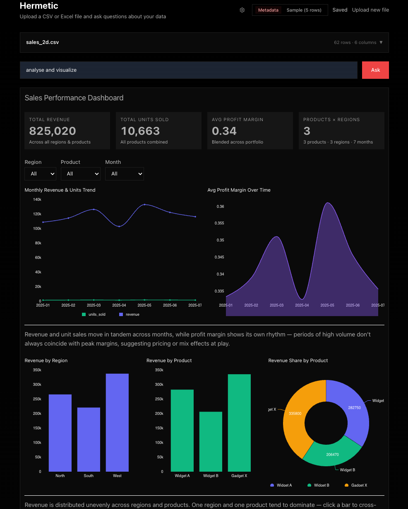
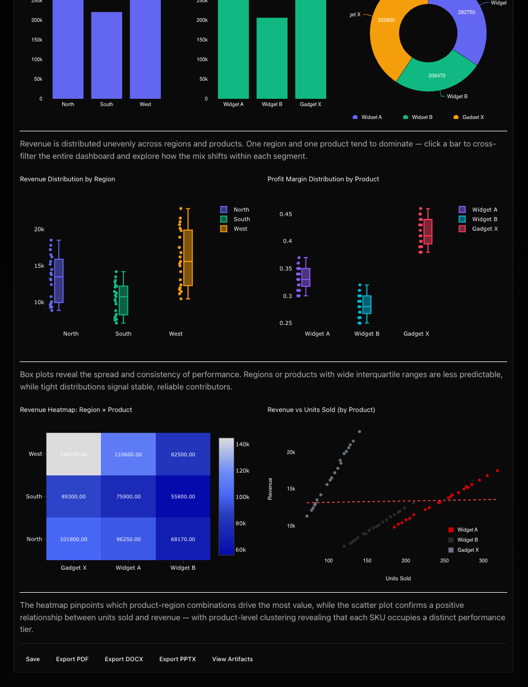

# Hermetic

**Ask your data anything.** Upload CSV, Excel, or GeoJSON files — or connect to PostgreSQL, BigQuery, ClickHouse, Trino, or Hive warehouses — ask questions in natural language, and get interactive dashboards. Designed for people who have data but not the skills to analyze it. Works with cloud LLMs (Anthropic, AWS Bedrock, Google Vertex, OpenAI-compatible) or local models via MLX, llama.cpp, or Ollama.




## Philosophy

Hermetic explores the idea that LLMs can generate correct data analysis code **without seeing the data itself**.

**Shape over samples.** Instead of sending rows to the LLM, Hermetic extracts the schema (column names, types, distributions, ranges, cardinality, correlations) and shares only that metadata as context. The LLM never sees actual data rows by default. This keeps data private, reduces token usage, and forces the model to reason about structure rather than memorize values.

**Blind execution.** The LLM generates Python code but never sees the results. Code runs in an isolated sandbox (Docker, microVM, or cloud), and the execution output (scalars, chart data, datasets) flows directly to the UI composition step. The LLM composing the dashboard works from result schemas and placeholders, not raw numbers. Every number displayed comes from actual computation on the real data.

**Sandboxed execution.** Code runs in containers or microVMs with no network access and no access to the host filesystem. Data is passed in via stdin and results are read from stdout. Warm sandbox modes (Docker, Microsandbox) reuse the underlying container across queries for speed but clear working data between runs. E2B creates a fresh sandbox each time.

**Adaptive UI.** The LLM composes a JSON-Render spec, a declarative layout of charts, stat cards, tables, annotations, and filters, tailored to each question. A bar chart for comparisons, a line chart for trends, stat cards for KPIs, a treemap for composition. The UI adapts to the question rather than using a fixed template.

## Features

### For Non-Technical Users

- **Ask your data anything.** Type a question in plain English — no SQL, no code, no formulas.
- **Smart question suggestions.** After uploading data, the LLM analyzes your schema and suggests specific, insightful questions tailored to your actual columns and patterns.
- **Try with sample data.** One-click sample dataset to explore Hermetic without needing your own data.
- **Analysis history.** Every question and its results are preserved in a scrollable session history. Re-run any previous question with one click.
- **Show your work.** Every analysis includes a plain-English methodology explanation — how many rows were analyzed, which columns were used, what operations were performed.
- **Six output styles.** Choose how results are presented: Dashboard, Narrative, Summary, Deep dive, Slides, or Report.
- **Light / Dark / System mode.** Toggle between light and dark themes, or follow your OS preference.

### Data Sources

- **File uploads.** CSV, Excel (multi-sheet workbooks with relationship detection), GeoJSON, JSON.
- **Data warehouses.** PostgreSQL, BigQuery, ClickHouse, Trino, Hive. SQL generated automatically from natural language, with cross-table JOINs.
- **Saved connections.** One-click reconnect to previously used warehouses — visible directly in the connection card.
- **Data explorer.** Collapsible right-side rail showing schema (column names, types, samples), data profile (row counts, distributions), and sample rows. Supports Excel sheet tabs and warehouse table navigation with split-panel layout.

### Visualization

- **30+ chart types.** Bar, line, area, pie, scatter, histogram, box plot, violin, heatmap, candlestick, sankey, treemap, sunburst, radar, bump, chord, waterfall, calendar, stream, ridgeline, dumbbell, slope, beeswarm, marimekko, bullet, parallel coordinates, confusion matrix, ROC curve, SHAP beeswarm, decision tree.
- **3D visualizations.** Scatter3D, Surface3D, Globe3D, deck.gl maps.
- **Geographic maps.** MapLibre GL vector tile maps with GeoJSON overlays, deck.gl layers (hexagon, column, arc, scatterplot, heatmap) with click/hover interactivity.
- **Adaptive dashboards.** The LLM composes layouts tailored to each question — bar charts for comparisons, line charts for trends, stat cards for KPIs.
- **Drill-down navigation.** Click chart segments to explore deeper.
- **Client-side filtering.** DataController enables instant cross-filtering across dashboards.

### Operations

- **Save and export.** Save visualizations, export as PDF, DOCX, or PPTX. Individual charts downloadable as PNG.
- **Artifacts viewer.** Bottom sheet panel with syntax-highlighted SQL, Python code, and computed data tables. Copy to clipboard or export as CSV/XLSX.
- **Update data.** Re-run saved visualizations with new data files. Schema-compatible updates skip LLM calls.

### Configuration

- **Multiple LLM providers.** Anthropic, AWS Bedrock, Google Vertex AI, OpenAI-compatible endpoints.
- **Local models.** MLX (Apple Silicon), llama.cpp, or Ollama. Detect, download, and activate models from the Settings drawer.
- **Four themes.** Focus (emerald, default), Stamen (cartographic), Info is Beautiful (vivid), Pentagram (reductive). Each with light and dark variants.
- **Sandbox runtimes.** Docker (local), E2B (cloud), Microsandbox (microVM).

## Data Warehouses

In addition to file uploads, Hermetic can connect directly to data warehouses. Ask questions in natural language and Hermetic generates SQL automatically, executes it against your warehouse, then analyzes and visualizes the results.

Supported warehouses: **PostgreSQL**, **BigQuery**, **ClickHouse**, **Trino**, **Hive**.

### Connecting

On the home screen, the **Connect a warehouse** card shows your saved connections as one-click pills. Click one to connect instantly. To add a new connection, click the card and fill in the type-specific form (host, port, credentials). Hermetic introspects all tables (columns, types, primary keys, foreign keys) so the LLM can generate cross-table JOINs.

Credentials are saved automatically after a successful connection. Saved connections are managed from the Settings drawer.

### How it works

```
User asks question
    → LLM generates dialect-aware SQL (across all tables)
    → Server executes SQL against the warehouse
    → Results flow as CSV into the existing pandas pipeline
    → Analysis code runs in sandbox → interactive dashboard
```

The SQL is available in the **Artifacts** panel (SQL tab) alongside the Python analysis code.

### PostgreSQL

Works with PostgreSQL, Amazon Redshift, Neon, Supabase, AlloyDB, CockroachDB, and any PostgreSQL wire-compatible database.

**Connection fields:**

| Field    | Example     | Notes                     |
| -------- | ----------- | ------------------------- |
| Host     | `localhost` | Hostname or IP            |
| Port     | `5432`      | Default: 5432             |
| Database | `mydb`      |                           |
| User     | `postgres`  |                           |
| Password |             |                           |
| Schema   | `public`    | Default: public           |
| SSL      | unchecked   | Check for cloud databases |

**Environment variables** (optional, for `start.sh` or `.env.local`):

```bash
WAREHOUSE_TYPE=postgresql
WAREHOUSE_PG_HOST=localhost
WAREHOUSE_PG_PORT=5432
WAREHOUSE_PG_DATABASE=mydb
WAREHOUSE_PG_USER=postgres
WAREHOUSE_PG_PASSWORD=secret
WAREHOUSE_PG_SCHEMA=public
WAREHOUSE_PG_SSL=false
```

**Sample dataset — Pagila (DVD rental):**

```bash
# Start a local PostgreSQL with the Pagila sample database
docker run -d --name pagila \
  -e POSTGRES_PASSWORD=postgres \
  -p 5432:5432 \
  postgresai/extended-postgres:16

# Load the Pagila dataset
docker exec -i pagila psql -U postgres -c "CREATE DATABASE pagila;"
curl -sL https://raw.githubusercontent.com/devrimgunduz/pagila/master/pagila-schema.sql | docker exec -i pagila psql -U postgres -d pagila
curl -sL https://raw.githubusercontent.com/devrimgunduz/pagila/master/pagila-data.sql | docker exec -i pagila psql -U postgres -d pagila
```

Then connect with: host `localhost`, port `5432`, database `pagila`, user `postgres`, password `postgres`.

Try asking: _"What are the top 10 most rented films and their total revenue?"_

### ClickHouse

**Connection fields:**

| Field    | Example               | Notes                      |
| -------- | --------------------- | -------------------------- |
| Host     | `play.clickhouse.com` | Hostname or IP             |
| Port     | `443`                 | 8123 (HTTP) or 443 (HTTPS) |
| Database | `default`             |                            |
| User     | `play`                |                            |
| Password |                       | Leave empty for playground |
| SSL      | checked               | Required for port 443      |

**Environment variables** (optional):

```bash
WAREHOUSE_TYPE=clickhouse
WAREHOUSE_CH_HOST=play.clickhouse.com
WAREHOUSE_CH_PORT=443
WAREHOUSE_CH_DATABASE=default
WAREHOUSE_CH_USER=play
WAREHOUSE_CH_PASSWORD=
WAREHOUSE_CH_SSL=true
```

**Free sample dataset — ClickHouse Playground:**

No setup needed. Connect to `play.clickhouse.com` (port `443`, user `play`, no password, SSL on). This public playground has dozens of pre-loaded datasets:

| Table                            | Description              | Rows   |
| -------------------------------- | ------------------------ | ------ |
| `uk_price_paid`                  | UK property transactions | 28M+   |
| `trips`                          | NYC taxi trips           | 3B+    |
| `cell_towers`                    | OpenCellID cell towers   | 43M+   |
| `dns`                            | DNS query logs           | 1M+    |
| `github_events`                  | GitHub event stream      | 200M+  |
| `stock`                          | Daily stock prices       | varies |
| `menu`, `menu_page`, `menu_item` | NYC restaurant menus     | varies |
| `opensky`                        | Flight tracking data     | 60M+   |

Try asking: _"Show the average property price trend by year in London"_ (against `uk_price_paid`)

### BigQuery

**Connection fields:**

| Field                | Example                              | Notes                                     |
| -------------------- | ------------------------------------ | ----------------------------------------- |
| Project ID           | `my-gcp-project`                     | Your GCP project (for billing)            |
| Dataset              | `bigquery-public-data.stackoverflow` | Use `project.dataset` for public datasets |
| Service Account JSON | `{ "type": "service_account", ... }` | Paste JSON key or path to `.json` file    |

**Environment variables** (optional):

```bash
WAREHOUSE_TYPE=bigquery
WAREHOUSE_BQ_PROJECT=my-gcp-project
WAREHOUSE_BQ_DATASET=bigquery-public-data.stackoverflow
WAREHOUSE_BQ_CREDENTIALS_JSON=/path/to/service-account.json
```

**Setup (5 minutes):**

1. Create a GCP project at [console.cloud.google.com](https://console.cloud.google.com) (free tier, no credit card for public datasets)
2. Go to **IAM & Admin > Service Accounts** > Create service account
3. Grant roles: **BigQuery Job User** + **BigQuery Data Viewer**
4. **Keys** > Add Key > Create new key > JSON — download the file
5. In Hermetic, enter your project ID, dataset, and paste the JSON key

**Free public datasets** (no data to load — already available):

| Dataset                                        | Description            |
| ---------------------------------------------- | ---------------------- |
| `bigquery-public-data.stackoverflow`           | Stack Overflow posts   |
| `bigquery-public-data.github_repos`            | GitHub repository data |
| `bigquery-public-data.austin_crime`            | Austin crime reports   |
| `bigquery-public-data.chicago_taxi_trips`      | Chicago taxi data      |
| `bigquery-public-data.usa_names`               | US baby names by year  |
| `bigquery-public-data.new_york_subway`         | NYC subway ridership   |
| `bigquery-public-data.google_analytics_sample` | GA web analytics       |

Enter the dataset as `bigquery-public-data.stackoverflow` (the `project.dataset` format tells Hermetic to query from that project while billing your project).

Try asking: _"What are the most popular programming language tags by year?"_

## Quick Start

```bash
git clone https://github.com/achalp/hermetic.git
cd hermetic
./start.sh
```

The setup script checks prerequisites, installs dependencies, sets up your chosen sandbox runtime, and starts the dev server. It will prompt you for an API key and let you choose between Docker and Microsandbox.

### Manual Setup

1. **Install dependencies**

   ```bash
   npm install
   ```

2. **Configure environment**

   ```bash
   cp .env.example .env.local
   ```

   Add credentials for your LLM provider (Anthropic API key, AWS credentials, or GCP project). See [Configuration](#configuration). For local-only usage with Ollama, no `.env.local` changes are needed. Configure it from the Settings UI instead.

3. **Set up a sandbox runtime** (pick one):

   **Option A: Docker** (default)

   ```bash
   docker build -t hermetic-sandbox docker/sandbox
   ```

   Requires [Docker Desktop](https://www.docker.com/products/docker-desktop/).

   **Option B: Microsandbox** (lightweight microVMs)

   ```bash
   # Install the microsandbox server
   curl -sSL https://get.microsandbox.dev | sh

   # Start the server (dev mode, no API key required)
   msb server start --dev
   ```

   Then set in `.env.local`:

   ```
   SANDBOX_RUNTIME=microsandbox
   MICROSANDBOX_URL=http://127.0.0.1:5555
   ```

   Requires macOS Apple Silicon (M1+) or Linux with KVM.

   **Option C: E2B** (cloud sandbox)

   ```
   SANDBOX_RUNTIME=e2b
   E2B_API_KEY=your-e2b-key
   ```

   Sign up at [e2b.dev](https://e2b.dev).

4. **Start the dev server**

   ```bash
   npm run dev
   ```

5. Open [http://localhost:3000](http://localhost:3000)

## Architecture

```
src/
  app/                  Next.js App Router
    api/
      query/            LLM query endpoint (streaming)
      upload/           File upload endpoint
      vizs/             Saved visualization CRUD
      artifacts/        Execution artifacts viewer
  components/
    app/                Application shell
      top-bar.tsx       Persistent header with actions
      source-cards.tsx  File upload + warehouse connect cards
      settings-drawer.tsx  Right-side settings panel
      data-rail.tsx     Collapsible data explorer rail
      data-explorer/    Schema, profile, sample, sheet/table views
      artifacts-panel.tsx  Bottom sheet for SQL/code/data
      analysis-history.tsx  Session history of past analyses
      suggestion-pills.tsx  LLM-generated question suggestions
    charts/             Chart components (Nivo, Plotly, deck.gl, MapLibre GL)
    controllers/        DataController for client-side filtering
    inputs/             Form inputs (Select, NumberInput, Toggle)
  lib/
    csv/                CSV parsing and schema extraction
    excel/              Excel file handling
    geojson/            GeoJSON parsing
    warehouse/          Data warehouse connectors (PostgreSQL, BigQuery, ClickHouse, Trino, Hive)
    llm/                LLM integration and prompt generation
    pipeline/           Query orchestration (code-gen, sandbox, UI compose)
    sandbox/            Code execution (Docker / E2B / Microsandbox)
    saved/              Saved visualization storage and versioning
    suggest-questions.ts  Heuristic question suggestion fallback
    purpose-prompts.ts  Output style definitions (Dashboard, Narrative, etc.)
```

### How It Works

**File uploads:**

1. **Upload.** CSV, Excel (multi-sheet), GeoJSON, or JSON file is parsed, schema extracted, and stored in memory.
2. **Query.** User question + schema sent to your configured LLM for Python code generation.
3. **Execute.** Generated code runs in a sandboxed Python environment with pandas, numpy, scipy, and scikit-learn.
4. **Compose.** Execution results sent to the LLM for UI composition as a JSON-Render spec.
5. **Render.** JSON-Render spec streamed to the browser and rendered as interactive React components.

**Warehouse queries** add two steps before the standard pipeline:

1. **SQL Generation.** User question + all table schemas (columns, types, PKs, FKs) sent to the LLM to generate a dialect-aware SQL query.
2. **SQL Execution.** Query runs against the warehouse. Results flow as CSV into the standard pipeline (steps 2-5 above).

Saved visualizations can be updated with new data files. If the schema matches, the saved code is re-executed directly without LLM calls.

## Development

```bash
npm run dev          # Start dev server
npm run build        # Production build
npm run lint         # ESLint
npm run lint:fix     # ESLint with auto-fix
npm run format       # Prettier format
npm run format:check # Prettier check
npm run type-check   # TypeScript check
npm test             # Run tests
npm run test:watch   # Tests in watch mode
npm run analyze      # Bundle analysis
```

## Sandbox Runtimes

Hermetic executes LLM-generated Python code in an isolated sandbox. Three runtimes are supported:

| Runtime              | How it works                          | Requirements                                                                                               |
| -------------------- | ------------------------------------- | ---------------------------------------------------------------------------------------------------------- |
| **Docker** (default) | Runs code in a local Docker container | [Docker Desktop](https://www.docker.com/products/docker-desktop/)                                          |
| **Microsandbox**     | Runs code in a lightweight microVM    | macOS Apple Silicon or Linux with KVM; [microsandbox server](https://github.com/microsandbox/microsandbox) |
| **E2B**              | Runs code in a cloud sandbox          | [E2B](https://e2b.dev) account and API key                                                                 |

Set `SANDBOX_RUNTIME` in `.env.local` to switch runtimes. The startup script (`start.sh`) lets you choose interactively.

## Configuration

### LLM Provider

Pick **one** provider. If `LLM_PROVIDER` is not set, the app auto-detects from available credentials. Ollama can be enabled from the Settings UI without any environment variables.

| Variable                 | Required                      | Default     | Description                                                                          |
| ------------------------ | ----------------------------- | ----------- | ------------------------------------------------------------------------------------ |
| `LLM_PROVIDER`           | No                            | auto-detect | Force a provider: `anthropic`, `bedrock`, `vertex`, `openai-compatible`, or `ollama` |
| `ANTHROPIC_API_KEY`      | If provider=anthropic         |             | Anthropic API key                                                                    |
| `AWS_ACCESS_KEY_ID`      | If provider=bedrock           |             | AWS access key (or use `AWS_PROFILE`)                                                |
| `AWS_SECRET_ACCESS_KEY`  | If provider=bedrock           |             | AWS secret key                                                                       |
| `AWS_REGION`             | No                            | `us-east-1` | AWS region for Bedrock                                                               |
| `GOOGLE_VERTEX_PROJECT`  | If provider=vertex            |             | GCP project ID                                                                       |
| `GOOGLE_VERTEX_LOCATION` | No                            | `us-east5`  | GCP region for Vertex AI                                                             |
| `OPENAI_BASE_URL`        | If provider=openai-compatible |             | OpenAI-compatible endpoint URL                                                       |
| `OPENAI_API_KEY`         | No                            |             | API key for the endpoint (not needed for Ollama)                                     |
| `OPENAI_MODEL`           | If provider=openai-compatible |             | Model name (e.g. `llama3.3`, `gpt-4o`)                                               |

### Local Models (MLX / llama.cpp / Ollama)

No environment variables needed. Open **Settings > Inference > Local Models** to detect, download, and activate models directly from the UI. MLX is available on Apple Silicon Macs. All three backends are managed from the same settings panel.

1. Install Ollama: `brew install ollama` (macOS) or see [ollama.com](https://ollama.com)
2. Start the server: `ollama serve`
3. Open Settings in Hermetic and activate a model

Recommended models for data analysis:

| Model                   | RAM    | Notes                             |
| ----------------------- | ------ | --------------------------------- |
| `qwen2.5-coder:14b`     | 16 GB+ | Best balance of quality and speed |
| `qwen2.5-coder:7b`      | 8 GB+  | Good for smaller machines         |
| `qwen2.5-coder:32b`     | 32 GB+ | Highest quality                   |
| `deepseek-coder-v2:16b` | 16 GB+ | Strong code and analysis          |
| `llama3.3:latest`       | 16 GB+ | General purpose                   |

When Ollama is activated in Settings, it takes priority over cloud providers. Deactivate it from Settings to switch back.

### Sandbox Runtime

| Variable               | Required                | Default                 | Description                                                      |
| ---------------------- | ----------------------- | ----------------------- | ---------------------------------------------------------------- |
| `SANDBOX_RUNTIME`      | No                      | `docker`                | Sandbox runtime: `docker`, `e2b`, or `microsandbox`              |
| `E2B_API_KEY`          | If runtime=e2b          |                         | E2B API key                                                      |
| `MICROSANDBOX_URL`     | If runtime=microsandbox | `http://127.0.0.1:5555` | Microsandbox server URL                                          |
| `MICROSANDBOX_API_KEY` | No                      |                         | Microsandbox API key                                             |
| `MICROSANDBOX_IMAGE`   | No                      | `microsandbox/python`   | Docker Hub image for the sandbox (packages installed at startup) |

## Components

### Charts

| Component           | Purpose                             | Library    |
| ------------------- | ----------------------------------- | ---------- |
| BarChart            | Categorical comparisons             | Nivo       |
| LineChart           | Trends over time                    | Nivo       |
| AreaChart           | Trends with volume                  | Nivo       |
| PieChart            | Part-of-whole composition           | Nivo       |
| ScatterChart        | Correlation between variables       | Nivo       |
| RadarChart          | Multivariate comparison             | Nivo       |
| BumpChart           | Ranking changes over time           | Nivo       |
| ChordChart          | Flow between categories             | Nivo       |
| SunburstChart       | Hierarchical composition            | Nivo       |
| TreemapChart        | Hierarchical proportions            | Nivo       |
| SankeyChart         | Flow quantities between nodes       | Nivo       |
| MarimekkoChart      | Two-dimensional composition         | Nivo       |
| CalendarChart       | Values over calendar days           | Nivo       |
| StreamChart         | Stacked trends over time            | Nivo       |
| Histogram           | Value distribution                  | Plotly     |
| BoxPlot             | Statistical distribution            | Plotly     |
| HeatMap             | Matrix of values by color           | Plotly     |
| ViolinChart         | Distribution shape comparison       | Plotly     |
| CandlestickChart    | OHLC financial data                 | Plotly     |
| WaterfallChart      | Cumulative value changes            | Plotly     |
| RidgelineChart      | Overlapping distributions           | Plotly     |
| DumbbellChart       | Range between two values            | Plotly     |
| SlopeChart          | Change between two points           | Plotly     |
| BeeswarmChart       | Distribution with individual points | Plotly     |
| ShapBeeswarm        | SHAP feature importance             | Plotly     |
| ConfusionMatrix     | Classification performance          | Plotly     |
| RocCurve            | Binary classifier performance       | Plotly     |
| ParallelCoordinates | Multivariate patterns               | Custom SVG |
| BulletChart         | Progress toward a target            | Custom SVG |
| DecisionTree        | Tree model visualization            | Custom SVG |

### 3D and Geospatial

| Component | Purpose                                       | Library        |
| --------- | --------------------------------------------- | -------------- |
| Scatter3D | 3D point clouds                               | Plotly         |
| Surface3D | 3D surface plots                              | Plotly         |
| Globe3D   | Points and arcs on a 3D globe                 | react-globe.gl |
| Map3D     | Hexagon, column, arc, scatter, heatmap layers | deck.gl        |
| MapView   | Markers and GeoJSON polygons on a 2D map      | MapLibre GL    |

### Display

| Component      | Purpose                               | Library        |
| -------------- | ------------------------------------- | -------------- |
| StatCard       | Single KPI with trend                 | Custom         |
| TextBlock      | Markdown or plain text                | Custom         |
| SectionBreak   | Visual section divider                | Custom         |
| Annotation     | Contextual notes                      | Custom         |
| TrendIndicator | Directional change indicator          | Custom         |
| DataTable      | Sortable, filterable, paginated table | TanStack Table |
| ChartImage     | Rendered image from sandbox           | Custom         |
| DataController | Client-side cross-filtering           | Custom         |

### Inputs

| Component     | Purpose                        | Library |
| ------------- | ------------------------------ | ------- |
| SelectControl | Dropdown select                | Custom  |
| NumberInput   | Numeric input with constraints | Custom  |
| ToggleSwitch  | Boolean toggle                 | Custom  |
| TextInput     | Single-line text input         | Custom  |
| TextArea      | Multi-line text input          | Custom  |

## Tech Stack

**Framework and rendering**

- [Next.js 16](https://nextjs.org/) with React 19
- [JSON-Render](https://json-render.dev/) for streaming declarative UI from JSON specs
- [Tailwind CSS v4](https://tailwindcss.com/)

**LLM integration**

- [Vercel AI SDK](https://sdk.vercel.ai/) with providers for Anthropic, AWS Bedrock, Google Vertex, and OpenAI-compatible endpoints
- [Zod](https://zod.dev/) for schema validation

**Charting**

- [Nivo](https://nivo.rocks/) (14 chart types)
- [Plotly.js](https://plotly.com/javascript/) (15 chart types including 3D)
- [deck.gl](https://deck.gl/) for large-scale geospatial layers
- [react-globe.gl](https://github.com/vasturiano/react-globe.gl) for 3D globe rendering
- [MapLibre GL JS](https://maplibre.org/) via [react-map-gl](https://visgl.github.io/react-map-gl/) for 2D vector tile maps
- [Three.js](https://threejs.org/) (peer dependency for globe and deck.gl)

**Data tables**

- [TanStack Table](https://tanstack.com/table) for headless table logic

**Data parsing**

- [PapaParse](https://www.papaparse.com/) for CSV
- [ExcelJS](https://github.com/exceljs/exceljs) for Excel workbooks

**Export**

- [jsPDF](https://github.com/parallax/jsPDF) for PDF generation
- [docx](https://github.com/dolanmiu/docx) for Word documents
- [PptxGenJS](https://github.com/gitbrent/PptxGenJS) for PowerPoint presentations
- [html-to-image](https://github.com/bubkoo/html-to-image) for chart PNG snapshots

**Sandbox runtimes**

- [Docker](https://www.docker.com/) for local container execution
- [E2B](https://e2b.dev/) for cloud sandbox execution
- [Microsandbox](https://github.com/microsandbox/microsandbox) for microVM execution

**Development**

- TypeScript 5, ESLint 9, Prettier, Husky, lint-staged
- [Vitest](https://vitest.dev/) with Testing Library for unit tests
- [@next/bundle-analyzer](https://www.npmjs.com/package/@next/bundle-analyzer) for bundle analysis

## Contributing

See [CONTRIBUTING.md](CONTRIBUTING.md) for development guidelines.

## License

[MIT](LICENSE)
