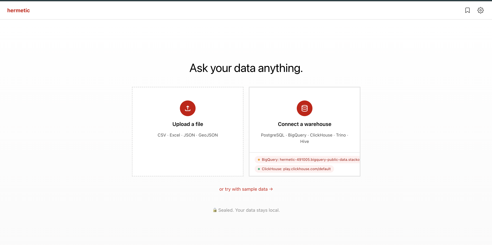
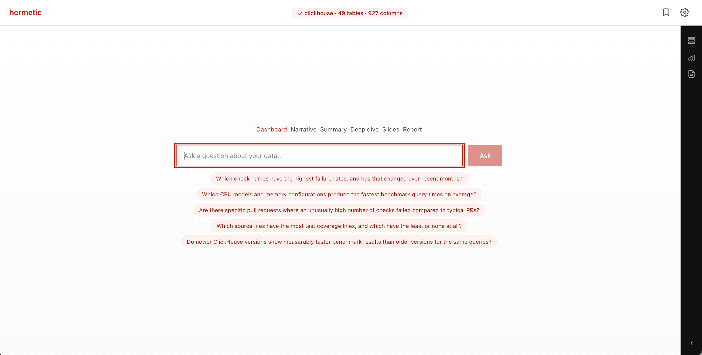
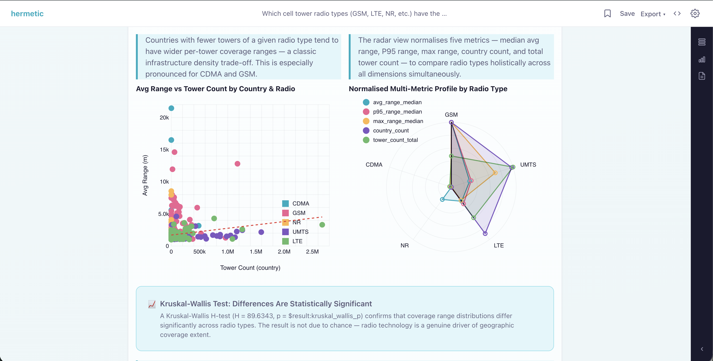
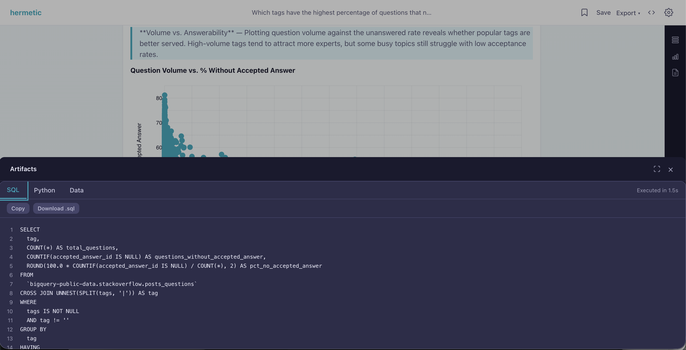
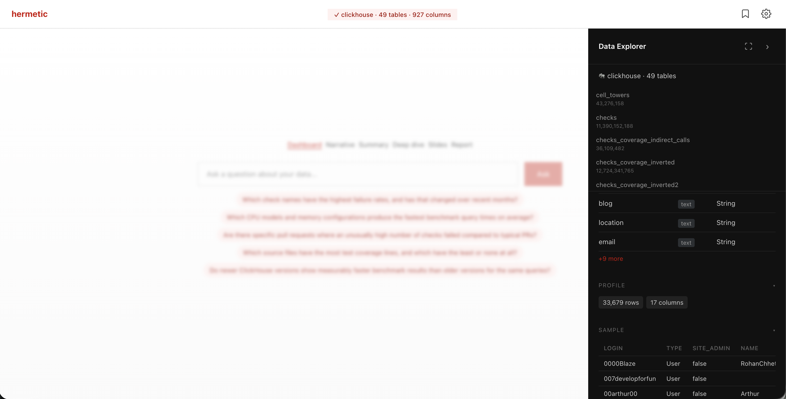
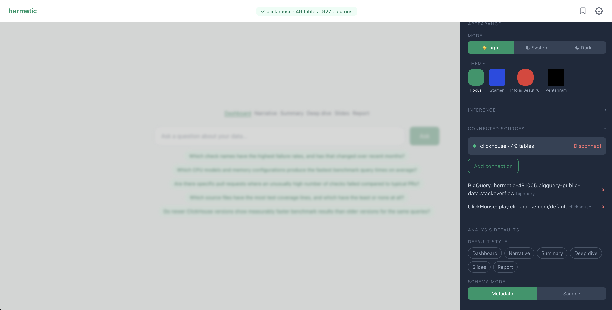
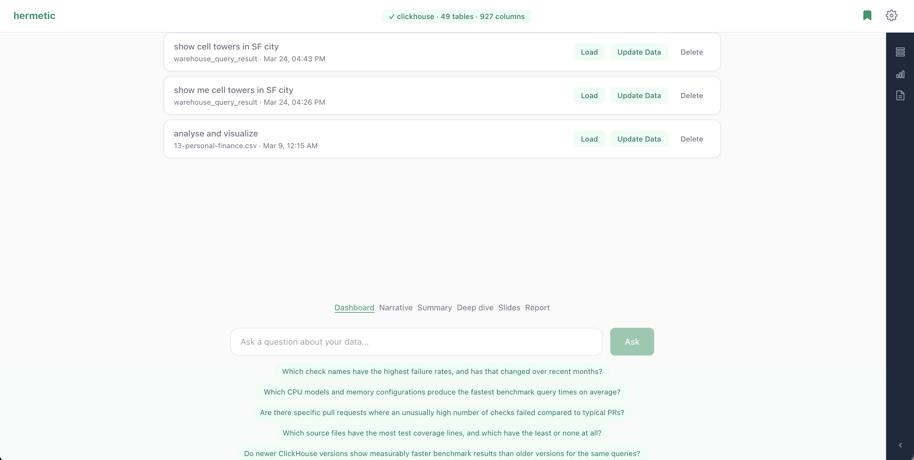

# Hermetic

**Ask your data anything.** Upload CSV, Excel, GeoJSON, or Parquet files (single file or Hive-partitioned folder via DuckDB) — or connect to PostgreSQL, BigQuery, ClickHouse, Snowflake, Databricks, Trino, or Hive — ask questions in natural language, and get interactive dashboards. Ask follow-up questions in conversation, kick off a multi-step **Investigate** for a full deep-dive, schedule a saved dashboard to refresh on a cron, and see exactly what each analysis costs. Designed for people who have data but not the skills to analyze it. Works with cloud LLMs (Anthropic, AWS Bedrock, Google Vertex, OpenAI-compatible) or local models via MLX, llama.cpp, or Ollama.















## Philosophy

Hermetic explores the idea that LLMs can generate correct data analysis code **without seeing the data itself**.

**Shape over samples.** Instead of sending rows to the LLM, Hermetic extracts the schema (column names, types, distributions, ranges, cardinality, correlations) and shares only that metadata as context. The LLM never sees actual data rows by default. This keeps data private, reduces token usage, and forces the model to reason about structure rather than memorize values.

**Blind execution.** The LLM generates Python code but never sees the results. Code runs in an isolated sandbox (Docker, microVM, or cloud), and the execution output (scalars, chart data, datasets) flows directly to the UI composition step. The LLM composing the dashboard works from result schemas and placeholders, not raw numbers. Every number displayed comes from actual computation on the real data.

**Sandboxed execution.** Code runs in containers or microVMs with no network access and no access to the host filesystem. Data is passed in via stdin and results are read from stdout. Warm sandbox modes (Docker, Microsandbox) reuse the underlying container across queries for speed but clear working data between runs. E2B creates a fresh sandbox each time.

**Adaptive UI.** The LLM composes a JSON-Render spec, a declarative layout of charts, stat cards, tables, annotations, and filters, tailored to each question. A bar chart for comparisons, a line chart for trends, stat cards for KPIs, a treemap for composition. The UI adapts to the question rather than using a fixed template.

## Features

### For Non-Technical Users

- **Ask your data anything.** Type a question in plain English — no SQL, no code, no formulas.
- **Conversational follow-ups.** Hermetic keeps conversation context server-side. "Exclude outliers and re-run", "break that down by quarter", "compare to last year" all work without re-explaining the setup.
- **Suggested follow-ups.** After a fresh analysis, inline pills suggest the next obvious questions based on what just came back.
- **Smart question suggestions.** After loading data, the LLM analyzes your schema and suggests specific, insightful questions tailored to your actual columns and patterns.
- **Try with sample data.** One-click sample dataset to explore Hermetic without needing your own data.
- **Start in one drag.** Drag a file straight onto the home screen (or click to browse), and see real example dashboards — the kind Hermetic generates — before you upload anything. The start screen leads with the privacy guarantee: the model writes the analysis code, but never sees your rows.
- **Show your work.** Every analysis includes a plain-English methodology explanation — how many rows were analyzed, which columns were used, what operations were performed.
- **Grounded numbers.** Every figure in a dashboard's narrative is checked against what the analysis actually computed; any number that traces to no result is flagged with a "verify this" caveat instead of being presented as fact. Applies to both single-shot dashboards and Investigate.
- **Four output styles.** Choose how results are framed: Dashboard (at-a-glance grid), Brief (bottom-line-up-front), Report (formal sectioned document), or Deep dive (exhaustive multi-angle). Slides (PPTX / Reveal deck) is an export format.
- **Light / Dark / System mode.** Toggle between light and dark themes, or follow your OS preference.

### Agentic Analysis

- **Investigate agent.** One question, a full deep-dive. The planner decomposes it into a few focused, penetrating sub-questions — the count scaled to the output style (a Brief stays tight at ~3; a Deep dive goes wide) — the orchestrator runs independent ones in parallel waves and dependent ones serially, and a composer synthesizes them into a single unified dashboard. Against a **data warehouse**, each sub-question generates its own targeted SQL that aggregates server-side over the full population (no row-cap sampling bias), bounded to a scan window sized from engine metadata so a billion-row table never blows the read limit. Progress streams live as a step list with status icons. The planner sees schema and stats only — never row values. Results render as a unified dashboard or as a step-by-step **notebook view** (each step's question, code, and result as a cell), exportable to Markdown, HTML, PDF, or Slides.
- **Per-run diagnostics.** Every Investigate (and Ask) run writes one structured JSON record to `data/diagnostics/<date>.jsonl` — materialization (rows, sampled, Parquet, SQL repairs), per sub-question (path, escalations + reason, retries + error classes, status), an aggregate summary, plus cost and call count. So "why did this run cost or behave this way" is answerable from data, not guesswork.
- **Multi-retry with reflection.** When generated code fails, the pipeline retries up to three times, carrying the full history of failed attempts forward. A reflection prompt kicks in after two failures so the model sees what it tried and why it broke, not just the original prompt.
- **Scheduled runs.** Saved dashboards can be scheduled with node-cron. Schedule popover anchored to the dashboard toolbar, schedule pills on saved-viz cards with edit/delete in place — a dashboard you built last week refreshes itself every Monday morning.
- **Persistent history.** Every analysis auto-saves to disk (generated code, results, visualizations). History survives restarts. Browse from a dedicated page, restore any previous result instantly, or re-run it against fresh data.

### Data Sources

- **File uploads.** CSV, Excel (multi-sheet workbooks with relationship detection), GeoJSON, JSON.
- **Parquet and DuckDB.** Local Parquet files and Hive-partitioned folders, with a file browser to pick them. Files bind-mount directly into the sandbox (zero-copy). For datasets over ~1M rows, aggregation is pushed into DuckDB SQL before touching pandas.
- **Data warehouses.** PostgreSQL, BigQuery, ClickHouse, Snowflake, Databricks, Trino, Hive. SQL generated automatically from natural language, with cross-table JOINs and dialect-aware prompt guidance.
- **dbt metadata enrichment.** If a dbt project is wired up, column-level descriptions are pulled into the LLM context alongside the warehouse schema.
- **Saved connections.** One-click reconnect to previously used warehouses — visible directly in the connection card. Per-warehouse tabs and color codes in the UI.
- **Data explorer.** Collapsible right-side rail showing schema (column names, types, samples), data profile (row counts, distributions), and sample rows. Supports Excel sheet tabs and warehouse table navigation with split-panel layout.

### Visualization

- **57 chart types.** Core (bar, line, area, pie, scatter, histogram, box, violin, heatmap); financial & KPI (candlestick, waterfall, funnel, gauge, bullet, dual-axis); flow & hierarchy (sankey, chord, treemap, sunburst, marimekko); statistics (Pareto, QQ, ECDF, survival/Kaplan–Meier, forest, control/SPC, correlogram, error bars/CI); ML (confusion matrix, ROC, calibration, lift/gain, partial dependence, SHAP beeswarm, dendrogram, silhouette, decision tree, network graph); and scientific/temporal (contour, ternary, population pyramid, Gantt, cohort grid, quiver, wind rose, calendar, stream, ridgeline, bump, radar, dumbbell, slope, beeswarm, sparkline, parallel coordinates).
- **3D visualizations.** Scatter3D, Surface3D, Globe3D, deck.gl maps.
- **Geographic maps.** MapLibre GL vector tile maps with GeoJSON overlays, deck.gl layers (hexagon, column, arc, scatterplot, heatmap) with click/hover interactivity.
- **Interactive pivot tables.** Sort, drill-through, drill-down, cross-filter against other widgets on the same dashboard, aggregator switcher, heatmap mode, multi-value and multi-aggregator support.
- **Adaptive dashboards.** The LLM composes layouts tailored to each question — bar charts for comparisons, line charts for trends, stat cards for KPIs.
- **Drill-down navigation.** Click chart segments to explore deeper.
- **Client-side filtering.** DataController enables instant cross-filtering across dashboards.
- **Expanded mode for every chart.** Chart components support full-height expanded rendering; labels truncate with tooltips instead of overlapping; WCAG-compliant font sizes throughout.

### Operations

- **Edit and re-run.** If the generated Python or SQL is 90% right, edit it directly in the code editor and rebuild the whole dashboard through the standard pipeline. The server skips the generation step for whichever artifact you edited and runs everything downstream.
- **Save and export.** Save visualizations, export as PDF, DOCX, or PPTX. Individual charts downloadable as PNG.
- **Artifacts viewer.** Bottom sheet panel with syntax-highlighted SQL, Python code, and computed data tables. Copy to clipboard or export as CSV/XLSX.
- **Update data.** Re-run saved visualizations with new data files. Schema-compatible updates skip LLM calls.
- **Cost tracking.** Every analysis' LLM token cost is captured automatically across the whole fan-out (code-gen, retries, planner, sub-questions, compose) with zero call-site threading, and surfaced three ways: a live footer (last analysis + running session total), a per-day CSV log (`data/cost/<date>.csv` with token buckets, per-analysis cost, and a **per-phase breakdown** — planner, SQL-gen, SQL-repair, code-gen, compose, …), and a `/cost` page with totals and a per-dataset breakdown, linked from Settings. Local or unknown models report $0 but still track tokens.
- **Cost-optimized by default.** Prompt caching (Anthropic ephemeral cache — roughly a 90% input discount on cache hits) wraps the large static prompts that every compose call re-sends, plus cheaper models for heavy vs. classification work, fewer retries, lazy cell composition, output volume scaled to the chosen style, and — for warehouse Investigate — per-step SQL that aggregates in the warehouse so code-gen runs over a small result instead of a million-row frame. The wins are largest on Investigate, which fans out into many LLM calls; per-phase cost telemetry is what made each lever measurable.

### Configuration

- **Multiple LLM providers.** Anthropic, AWS Bedrock, Google Vertex AI, OpenAI-compatible endpoints.
- **Local models.** MLX (Apple Silicon), llama.cpp, or Ollama. Detect, download, and activate models from the Settings drawer.
- **Four themes.** Focus (emerald, default), Stamen (cartographic), Info is Beautiful (vivid), Pentagram (reductive). Each with light and dark variants.
- **Sandbox runtimes.** Docker (local), E2B (cloud), Microsandbox (microVM).

## Data Warehouses

In addition to file uploads, Hermetic can connect directly to data warehouses. Ask questions in natural language and Hermetic generates SQL automatically, executes it against your warehouse, then analyzes and visualizes the results.

Supported warehouses: **PostgreSQL**, **BigQuery**, **ClickHouse**, **Snowflake**, **Databricks**, **Trino**, **Hive**.

### Connecting

On the home screen, the **Connect a warehouse** card shows your saved connections as one-click pills. Click one to connect instantly. To add a new connection, click the card and fill in the type-specific form (host, port, credentials). Hermetic introspects all tables (columns, types, primary keys, foreign keys) so the LLM can generate cross-table JOINs.

Credentials are saved automatically after a successful connection. Saved connections are managed from the Settings drawer.

### How it works

```
User asks question
    → LLM generates dialect-aware SQL (bounded to a metadata-sized scan window)
    → Server executes it — self-healing on engine errors (repair + retry)
    → Results flow as CSV into the existing pandas pipeline
    → Analysis code runs in sandbox → interactive dashboard
```

The SQL is available in the **Artifacts** panel (SQL tab) alongside the Python analysis code.

### Warehouse queries are hardened — and Investigate goes further

**Every** warehouse query — single-shot **Ask** and multi-step **Investigate** alike — runs through the same shared hardening, so a billion-row table doesn't sink it:

- **Bounded scan from engine metadata (not a data scan).** Before generating SQL, Hermetic sizes a recent window from metadata — ClickHouse `system.tables` sort-key bounds, BigQuery `INFORMATION_SCHEMA.PARTITIONS` (partition values + row counts), with a `MIN/MAX` fallback on a real date column — and hands that exact window to SQL-gen so the query never trips the read/byte limit.
- **Self-healing SQL.** A failed query is repaired by feeding the exact engine error back to the model — bad GROUP BY, memory blowup, a too-wide scan (`rows to read exceeded`), an empty result from a dead partition filter — and retried. Co-occurrence/pairwise questions are steered to array collapse + `ARRAY JOIN` instead of fact-table self-joins.

**Investigate adds more for its fan-out:**

- **Bounded materialization + per-step SQL.** It materializes one bounded snapshot for planning, then each sub-question generates its **own** targeted query that aggregates server-side over the full population (no row-cap sampling bias), returning a small result — code-gen runs over kilobytes instead of a million-row frame.
- **Large pulls via Parquet + DuckDB.** A big materialized pull is converted to Parquet and analyzed through DuckDB before pandas — raising the in-memory ceiling well past a million rows, fallback-safe to CSV. When the snapshot is a capped sample, the dashboard discloses it.

Tested end-to-end against live public warehouses (ClickHouse Playground, BigQuery public datasets).

### PostgreSQL

Works with PostgreSQL, Amazon Redshift, Neon, Supabase, AlloyDB, CockroachDB, and any PostgreSQL wire-compatible database.

**Connection fields:**

| Field    | Example     | Notes                     |
| -------- | ----------- | ------------------------- |
| Host     | `localhost` | Hostname or IP            |
| Port     | `5432`      | Default: 5432             |
| Database | `mydb`      |                           |
| User     | `postgres`  |                           |
| Password |             |                           |
| Schema   | `public`    | Default: public           |
| SSL      | unchecked   | Check for cloud databases |

**Environment variables** (optional, for `start.sh` or `.env.local`):

```bash
WAREHOUSE_TYPE=postgresql
WAREHOUSE_PG_HOST=localhost
WAREHOUSE_PG_PORT=5432
WAREHOUSE_PG_DATABASE=mydb
WAREHOUSE_PG_USER=postgres
WAREHOUSE_PG_PASSWORD=secret
WAREHOUSE_PG_SCHEMA=public
WAREHOUSE_PG_SSL=false
```

**Sample dataset — Pagila (DVD rental):**

```bash
# Start a local PostgreSQL with the Pagila sample database
docker run -d --name pagila \
  -e POSTGRES_PASSWORD=postgres \
  -p 5432:5432 \
  postgresai/extended-postgres:16

# Load the Pagila dataset
docker exec -i pagila psql -U postgres -c "CREATE DATABASE pagila;"
curl -sL https://raw.githubusercontent.com/devrimgunduz/pagila/master/pagila-schema.sql | docker exec -i pagila psql -U postgres -d pagila
curl -sL https://raw.githubusercontent.com/devrimgunduz/pagila/master/pagila-data.sql | docker exec -i pagila psql -U postgres -d pagila
```

Then connect with: host `localhost`, port `5432`, database `pagila`, user `postgres`, password `postgres`.

Try asking: _"What are the top 10 most rented films and their total revenue?"_

### ClickHouse

**Connection fields:**

| Field    | Example               | Notes                      |
| -------- | --------------------- | -------------------------- |
| Host     | `play.clickhouse.com` | Hostname or IP             |
| Port     | `443`                 | 8123 (HTTP) or 443 (HTTPS) |
| Database | `default`             |                            |
| User     | `play`                |                            |
| Password |                       | Leave empty for playground |
| SSL      | checked               | Required for port 443      |

**Environment variables** (optional):

```bash
WAREHOUSE_TYPE=clickhouse
WAREHOUSE_CH_HOST=play.clickhouse.com
WAREHOUSE_CH_PORT=443
WAREHOUSE_CH_DATABASE=default
WAREHOUSE_CH_USER=play
WAREHOUSE_CH_PASSWORD=
WAREHOUSE_CH_SSL=true
```

**Free sample dataset — ClickHouse Playground:**

No setup needed. Connect to `play.clickhouse.com` (port `443`, user `play`, no password, SSL on). This public playground has dozens of pre-loaded datasets:

| Table                            | Description              | Rows   |
| -------------------------------- | ------------------------ | ------ |
| `uk_price_paid`                  | UK property transactions | 28M+   |
| `trips`                          | NYC taxi trips           | 3B+    |
| `cell_towers`                    | OpenCellID cell towers   | 43M+   |
| `dns`                            | DNS query logs           | 1M+    |
| `github_events`                  | GitHub event stream      | 200M+  |
| `stock`                          | Daily stock prices       | varies |
| `menu`, `menu_page`, `menu_item` | NYC restaurant menus     | varies |
| `opensky`                        | Flight tracking data     | 60M+   |

Try asking: _"Show the average property price trend by year in London"_ (against `uk_price_paid`)

### BigQuery

**Connection fields:**

| Field                | Example                              | Notes                                     |
| -------------------- | ------------------------------------ | ----------------------------------------- |
| Project ID           | `my-gcp-project`                     | Your GCP project (for billing)            |
| Dataset              | `bigquery-public-data.stackoverflow` | Use `project.dataset` for public datasets |
| Service Account JSON | `{ "type": "service_account", ... }` | Paste JSON key or path to `.json` file    |

**Environment variables** (optional):

```bash
WAREHOUSE_TYPE=bigquery
WAREHOUSE_BQ_PROJECT=my-gcp-project
WAREHOUSE_BQ_DATASET=bigquery-public-data.stackoverflow
WAREHOUSE_BQ_CREDENTIALS_JSON=/path/to/service-account.json
```

**Setup (5 minutes):**

1. Create a GCP project at [console.cloud.google.com](https://console.cloud.google.com) (free tier, no credit card for public datasets)
2. Go to **IAM & Admin > Service Accounts** > Create service account
3. Grant roles: **BigQuery Job User** + **BigQuery Data Viewer**
4. **Keys** > Add Key > Create new key > JSON — download the file
5. In Hermetic, enter your project ID, dataset, and paste the JSON key

**Free public datasets** (no data to load — already available):

| Dataset                                        | Description            |
| ---------------------------------------------- | ---------------------- |
| `bigquery-public-data.stackoverflow`           | Stack Overflow posts   |
| `bigquery-public-data.github_repos`            | GitHub repository data |
| `bigquery-public-data.austin_crime`            | Austin crime reports   |
| `bigquery-public-data.chicago_taxi_trips`      | Chicago taxi data      |
| `bigquery-public-data.usa_names`               | US baby names by year  |
| `bigquery-public-data.new_york_subway`         | NYC subway ridership   |
| `bigquery-public-data.google_analytics_sample` | GA web analytics       |

Enter the dataset as `bigquery-public-data.stackoverflow` (the `project.dataset` format tells Hermetic to query from that project while billing your project).

Try asking: _"What are the most popular programming language tags by year?"_

### Snowflake

**Connection fields:**

| Field     | Example             | Notes                             |
| --------- | ------------------- | --------------------------------- |
| Account   | `xy12345.us-east-1` | Your Snowflake account identifier |
| Username  | `analyst`           |                                   |
| Password  |                     | Or use key-pair auth              |
| Warehouse | `COMPUTE_WH`        |                                   |
| Database  | `ANALYTICS`         |                                   |
| Schema    | `PUBLIC`            |                                   |
| Role      | `ANALYST_ROLE`      | Optional                          |

### Databricks

**Connection fields:**

| Field           | Example                            | Notes                                     |
| --------------- | ---------------------------------- | ----------------------------------------- |
| Server hostname | `abc-1234.cloud.databricks.com`    | Your workspace host                       |
| HTTP path       | `/sql/1.0/warehouses/abc123def456` | From the SQL warehouse connection details |
| Access token    | `dapi…`                            | Personal access token                     |
| Catalog         | `main`                             |                                           |
| Schema          | `default`                          |                                           |

### Trino / Hive

Both have inline connection forms with host, port, catalog/database, and credentials. Trino works with Starburst and any Trino-compatible engine.

## Parquet and Local Files

Point Hermetic at a Parquet file or a Hive-partitioned folder on your local disk and analyze it without uploading.

Click the **Browse local files** entry on the home screen, navigate to the file or folder, and pick it. The file is bind-mounted into the sandbox (zero-copy — no upload, no conversion). DuckDB extracts schema and statistics; for queries over ~1M rows, aggregation is pushed into DuckDB SQL before any pandas code runs.

Hive-partitioned folders (e.g. `year=2024/month=01/...`) are detected as a single dataset; partition columns appear in the schema alongside the file columns.

## Quick Start

```bash
git clone https://github.com/achalp/hermetic.git
cd hermetic
./start.sh
```

The setup script checks prerequisites, installs dependencies, sets up your chosen sandbox runtime, and starts the dev server. It will prompt you for an API key and let you choose between Docker and Microsandbox.

### Manual Setup

1. **Install dependencies**

   This project uses [pnpm](https://pnpm.io). Enable it with Corepack (bundled with Node), then install:

   ```bash
   corepack enable
   pnpm install
   ```

   The committed `pnpm-lock.yaml` is registry-agnostic, so it installs cleanly against the public npm registry or a corporate mirror (e.g. Artifactory) configured in your `~/.npmrc`.

2. **Configure environment**

   ```bash
   cp .env.example .env.local
   ```

   Add credentials for your LLM provider (Anthropic API key, AWS credentials, or GCP project). See [Configuration](#configuration). For local-only usage with Ollama, no `.env.local` changes are needed. Configure it from the Settings UI instead.

3. **Set up a sandbox runtime** (pick one):

   **Option A: Docker** (default)

   ```bash
   docker build -t hermetic-sandbox docker/sandbox
   ```

   Requires [Docker Desktop](https://www.docker.com/products/docker-desktop/).

   **Option B: Microsandbox** (lightweight microVMs)

   ```bash
   # Install the microsandbox server
   curl -sSL https://get.microsandbox.dev | sh

   # Start the server (dev mode, no API key required)
   msb server start --dev
   ```

   Then set in `.env.local`:

   ```
   SANDBOX_RUNTIME=microsandbox
   MICROSANDBOX_URL=http://127.0.0.1:5555
   ```

   Requires macOS Apple Silicon (M1+) or Linux with KVM.

   **Option C: E2B** (cloud sandbox)

   ```
   SANDBOX_RUNTIME=e2b
   E2B_API_KEY=your-e2b-key
   ```

   Sign up at [e2b.dev](https://e2b.dev).

4. **Start the dev server**

   ```bash
   pnpm dev
   ```

5. Open [http://localhost:3000](http://localhost:3000)

## Architecture

```
src/
  app/                  Next.js App Router
    api/
      query/            LLM query endpoint (streaming, with conversation context)
      upload/           File upload endpoint
      local-files/      Local file browser + Parquet/DuckDB ingest
      warehouse/        Warehouse connection + introspection endpoints
      vizs/             Saved visualization CRUD + scheduling
      history/          Persistent analysis history
      artifacts/        Execution artifacts viewer
      suggest/          Question suggestion endpoint
      providers/        LLM provider detection
      runtimes/         Sandbox runtime status
      ollama/           Ollama model management
      local-llm/        Local model (MLX / llama.cpp) management
    history/            Persistent history page
  components/
    app/                Application shell
      top-bar.tsx       Persistent header with actions
      source-cards.tsx  File / warehouse / local file source cards
      settings-drawer.tsx  Right-side settings panel
      settings/         Inference, models, appearance, connected sources
      data-rail.tsx     Collapsible data explorer rail
      data-explorer/    Schema, profile, sample, sheet/table views
      local-file-browser.tsx  File system picker for Parquet/CSV
      schedule-popover.tsx    Cron scheduling UI for saved dashboards
      code-editor.tsx   Edit-and-rerun Python / SQL editor
      artifacts-panel.tsx  Bottom sheet for SQL/code/data
      analysis-history.tsx  Session + persistent history of past analyses
      saved-vizs-panel.tsx  Saved dashboards with schedule pills
      suggestion-pills.tsx  LLM-generated question + follow-up suggestions
    charts/             57 chart components (Nivo, Plotly, deck.gl, MapLibre GL)
    pivot-table.tsx     Interactive pivot table (sort, drill, cross-filter)
    controllers/        DataController for client-side filtering
    inputs/             Form inputs (Select, NumberInput, Toggle)
  lib/
    csv/                CSV parsing and schema extraction
    excel/              Excel file handling
    geojson/            GeoJSON parsing
    parquet/            Parquet schema extraction via DuckDB
    local-files/        Local file browser + path sandboxing
    warehouse/          Data warehouse connectors
      postgres, bigquery, clickhouse, snowflake, databricks, trino, hive
      sql-generation.ts dialect-aware SQL prompts
      dbt-metadata.ts   dbt column-description enrichment
      infer-relationships.ts  FK/PK + heuristic relationship detection
    llm/                LLM client, prompts, code generation
      investigate-planner.ts   Decompose question → sub-questions
      investigate-composer.ts  Synthesize sub-results → one dashboard
      resolve-placeholders.ts  Hydrate composed spec with real values
    pipeline/           Query orchestration
      orchestrator.ts            Single-question pipeline w/ multi-retry
      investigate-orchestrator.ts Multi-step Investigate runner
      conversation-cache.ts      Server-side follow-up context
      code-cache.ts              Edit-rerun cached artifacts
      artifacts-cache.ts         Execution artifact cache
    sandbox/            Code execution (Docker warm / E2B / Microsandbox warm)
    saved/              Saved viz storage, versioning, scheduler (node-cron)
    history/            Persistent on-disk history
    cost/               Per-analysis LLM cost capture (usage middleware + accumulator), pricing, daily CSV storage
    suggest-questions.ts  Heuristic question suggestion fallback
    purpose-prompts.ts  Output style definitions (Dashboard, Brief, Report, Deep dive)
```

### How It Works

**File uploads:**

1. **Load.** CSV, Excel (multi-sheet), GeoJSON, JSON, or Parquet file is parsed, schema extracted, and stored in memory (Parquet stays on disk and is bind-mounted into the sandbox).
2. **Query.** User question + schema (and prior conversation history, if any) sent to your configured LLM for Python code generation.
3. **Execute.** Generated code runs in a sandboxed Python environment with pandas, numpy, scipy, scikit-learn, and DuckDB. Failures retry up to 3× with a reflection prompt after the second attempt.
4. **Compose.** Execution results sent to the LLM for UI composition as a JSON-Render spec.
5. **Render.** JSON-Render spec streamed to the browser and rendered as interactive React components. Every analysis auto-saves to persistent history.

**Warehouse queries** add two steps before the standard pipeline:

1. **SQL Generation.** User question + all table schemas (columns, types, PKs, FKs, dbt descriptions if present) sent to the LLM to generate a dialect-aware SQL query.
2. **SQL Execution.** Query runs against the warehouse. Results flow as CSV into the standard pipeline (steps 2–5 above).

**Investigate** runs a higher-level loop on top of the standard pipeline:

1. **Plan.** The planner sees schema + stats only and decomposes the question into 3–7 sub-questions with a dependency graph.
2. **Orchestrate.** Independent sub-questions run in parallel waves; dependent ones run serially. Each sub-question uses the standard pipeline.
3. **Compose.** The composer synthesizes all sub-results into a single unified JSON-Render spec.

**Conversational follow-ups** are handled by the conversation cache: each turn's question, generated code, and result schema are kept server-side so the next turn's LLM call has full context. "Exclude outliers and re-run" works without you restating the original setup.

**Edit-and-rerun.** Open the code editor, change the Python or SQL, and re-run. The server skips the corresponding generation step and runs everything downstream.

**Saved visualizations** can be updated with new data files (schema-compatible updates skip LLM calls) or scheduled to refresh on a cron (node-cron). Schedule pills appear on saved-viz cards with edit/delete in place.

## Development

```bash
pnpm dev             # Start dev server
pnpm build           # Production build
pnpm lint            # ESLint
pnpm lint:fix        # ESLint with auto-fix
pnpm format          # Prettier format
pnpm format:check    # Prettier check
pnpm type-check      # TypeScript check
pnpm test            # Run tests
pnpm test:watch      # Tests in watch mode
pnpm analyze         # Bundle analysis
```

## Sandbox Runtimes

Hermetic executes LLM-generated Python code in an isolated sandbox. Three runtimes are supported:

| Runtime              | How it works                          | Requirements                                                                                               |
| -------------------- | ------------------------------------- | ---------------------------------------------------------------------------------------------------------- |
| **Docker** (default) | Runs code in a local Docker container | [Docker Desktop](https://www.docker.com/products/docker-desktop/)                                          |
| **Microsandbox**     | Runs code in a lightweight microVM    | macOS Apple Silicon or Linux with KVM; [microsandbox server](https://github.com/microsandbox/microsandbox) |
| **E2B**              | Runs code in a cloud sandbox          | [E2B](https://e2b.dev) account and API key                                                                 |

Set `SANDBOX_RUNTIME` in `.env.local` to switch runtimes. The startup script (`start.sh`) lets you choose interactively.

## Configuration

### LLM Provider

Pick **one** provider. If `LLM_PROVIDER` is not set, the app auto-detects from available credentials. Ollama can be enabled from the Settings UI without any environment variables.

| Variable                 | Required                      | Default     | Description                                                                          |
| ------------------------ | ----------------------------- | ----------- | ------------------------------------------------------------------------------------ |
| `LLM_PROVIDER`           | No                            | auto-detect | Force a provider: `anthropic`, `bedrock`, `vertex`, `openai-compatible`, or `ollama` |
| `ANTHROPIC_API_KEY`      | If provider=anthropic         |             | Anthropic API key                                                                    |
| `AWS_ACCESS_KEY_ID`      | If provider=bedrock           |             | AWS access key (or use `AWS_PROFILE`)                                                |
| `AWS_SECRET_ACCESS_KEY`  | If provider=bedrock           |             | AWS secret key                                                                       |
| `AWS_REGION`             | No                            | `us-east-1` | AWS region for Bedrock                                                               |
| `GOOGLE_VERTEX_PROJECT`  | If provider=vertex            |             | GCP project ID                                                                       |
| `GOOGLE_VERTEX_LOCATION` | No                            | `us-east5`  | GCP region for Vertex AI                                                             |
| `OPENAI_BASE_URL`        | If provider=openai-compatible |             | OpenAI-compatible endpoint URL                                                       |
| `OPENAI_API_KEY`         | No                            |             | API key for the endpoint (not needed for Ollama)                                     |
| `OPENAI_MODEL`           | If provider=openai-compatible |             | Model name (e.g. `llama3.3`, `gpt-4o`)                                               |

### Local Models (MLX / llama.cpp / Ollama)

No environment variables needed. Open **Settings > Inference > Local Models** to detect, download, and activate models directly from the UI. MLX is available on Apple Silicon Macs. All three backends are managed from the same settings panel.

1. Install Ollama: `brew install ollama` (macOS) or see [ollama.com](https://ollama.com)
2. Start the server: `ollama serve`
3. Open Settings in Hermetic and activate a model

Recommended models for data analysis:

| Model                   | RAM    | Notes                             |
| ----------------------- | ------ | --------------------------------- |
| `qwen2.5-coder:14b`     | 16 GB+ | Best balance of quality and speed |
| `qwen2.5-coder:7b`      | 8 GB+  | Good for smaller machines         |
| `qwen2.5-coder:32b`     | 32 GB+ | Highest quality                   |
| `deepseek-coder-v2:16b` | 16 GB+ | Strong code and analysis          |
| `llama3.3:latest`       | 16 GB+ | General purpose                   |

When Ollama is activated in Settings, it takes priority over cloud providers. Deactivate it from Settings to switch back.

### Sandbox Runtime

| Variable               | Required                | Default                 | Description                                                      |
| ---------------------- | ----------------------- | ----------------------- | ---------------------------------------------------------------- |
| `SANDBOX_RUNTIME`      | No                      | `docker`                | Sandbox runtime: `docker`, `e2b`, or `microsandbox`              |
| `E2B_API_KEY`          | If runtime=e2b          |                         | E2B API key                                                      |
| `MICROSANDBOX_URL`     | If runtime=microsandbox | `http://127.0.0.1:5555` | Microsandbox server URL                                          |
| `MICROSANDBOX_API_KEY` | No                      |                         | Microsandbox API key                                             |
| `MICROSANDBOX_IMAGE`   | No                      | `microsandbox/python`   | Docker Hub image for the sandbox (packages installed at startup) |

## Components

### Charts

| Component           | Purpose                                | Library    |
| ------------------- | -------------------------------------- | ---------- |
| BarChart            | Categorical comparisons                | Nivo       |
| LineChart           | Trends over time                       | Nivo       |
| AreaChart           | Trends with volume                     | Nivo       |
| PieChart            | Part-of-whole composition              | Nivo       |
| ScatterChart        | Correlation between variables          | Nivo       |
| RadarChart          | Multivariate comparison                | Nivo       |
| BumpChart           | Ranking changes over time              | Nivo       |
| ChordChart          | Flow between categories                | Nivo       |
| SunburstChart       | Hierarchical composition               | Nivo       |
| TreemapChart        | Hierarchical proportions               | Nivo       |
| SankeyChart         | Flow quantities between nodes          | Nivo       |
| MarimekkoChart      | Two-dimensional composition            | Nivo       |
| CalendarChart       | Values over calendar days              | Nivo       |
| StreamChart         | Stacked trends over time               | Nivo       |
| Histogram           | Value distribution                     | Plotly     |
| BoxPlot             | Statistical distribution               | Plotly     |
| HeatMap             | Matrix of values by color              | Plotly     |
| ViolinChart         | Distribution shape comparison          | Plotly     |
| CandlestickChart    | OHLC financial data                    | Plotly     |
| WaterfallChart      | Cumulative value changes               | Plotly     |
| RidgelineChart      | Overlapping distributions              | Plotly     |
| DumbbellChart       | Range between two values               | Plotly     |
| SlopeChart          | Change between two points              | Plotly     |
| BeeswarmChart       | Distribution with individual points    | Plotly     |
| ShapBeeswarm        | SHAP feature importance                | Plotly     |
| ConfusionMatrix     | Classification performance             | Plotly     |
| RocCurve            | Binary classifier performance          | Plotly     |
| ParallelCoordinates | Multivariate patterns                  | Custom SVG |
| BulletChart         | Progress toward a target               | Custom SVG |
| DecisionTree        | Tree model visualization               | Custom SVG |
| ErrorBarChart       | Points/bars with confidence intervals  | Plotly     |
| DualAxisChart       | Two measures on independent y-axes     | Plotly     |
| FunnelChart         | Sequential conversion / drop-off       | Plotly     |
| GaugeChart          | Single KPI against a scale             | Plotly     |
| Sparkline           | Compact inline trend                   | Custom SVG |
| ParetoChart         | 80/20 — sorted bars + cumulative %     | Plotly     |
| QQPlot              | Normality check vs. quantiles          | Plotly     |
| ECDFChart           | Empirical cumulative distribution      | Plotly     |
| SurvivalChart       | Kaplan–Meier survival curves           | Plotly     |
| ForestPlot          | Effect sizes with confidence intervals | Plotly     |
| ControlChart        | SPC chart with control limits          | Plotly     |
| Correlogram         | ACF / PACF autocorrelation             | Plotly     |
| CalibrationCurve    | Classifier reliability diagram         | Plotly     |
| LiftChart           | Lift / cumulative gain                 | Plotly     |
| PartialDependence   | Model PDP / ICE curves                 | Plotly     |
| Dendrogram          | Hierarchical clustering tree           | Plotly     |
| SilhouettePlot      | Clustering quality by cluster          | Plotly     |
| NetworkGraph        | Node-link relationships                | Plotly     |
| ContourChart        | 2D density / scalar field              | Plotly     |
| TernaryChart        | Three-part compositional data          | Plotly     |
| PopulationPyramid   | Back-to-back category comparison       | Plotly     |
| GanttChart          | Task timelines on a date axis          | Plotly     |
| CohortGrid          | Retention matrix by cohort × period    | Plotly     |
| QuiverChart         | Vector / flow field                    | Plotly     |
| WindRose            | Polar histogram by direction           | Plotly     |

### 3D and Geospatial

| Component | Purpose                                       | Library        |
| --------- | --------------------------------------------- | -------------- |
| Scatter3D | 3D point clouds                               | Plotly         |
| Surface3D | 3D surface plots                              | Plotly         |
| Globe3D   | Points and arcs on a 3D globe                 | react-globe.gl |
| Map3D     | Hexagon, column, arc, scatter, heatmap layers | deck.gl        |
| MapView   | Markers and GeoJSON polygons on a 2D map      | MapLibre GL    |

### Display

| Component      | Purpose                               | Library        |
| -------------- | ------------------------------------- | -------------- |
| StatCard       | Single KPI with trend                 | Custom         |
| TextBlock      | Markdown or plain text                | Custom         |
| SectionBreak   | Visual section divider                | Custom         |
| Annotation     | Contextual notes                      | Custom         |
| TrendIndicator | Directional change indicator          | Custom         |
| DataTable      | Sortable, filterable, paginated table | TanStack Table |
| PivotTable     | Sort, drill, cross-filter, heatmap    | Custom         |
| ChartImage     | Rendered image from sandbox           | Custom         |
| DataController | Client-side cross-filtering           | Custom         |

### Inputs

| Component     | Purpose                        | Library |
| ------------- | ------------------------------ | ------- |
| SelectControl | Dropdown select                | Custom  |
| NumberInput   | Numeric input with constraints | Custom  |
| ToggleSwitch  | Boolean toggle                 | Custom  |
| TextInput     | Single-line text input         | Custom  |
| TextArea      | Multi-line text input          | Custom  |

## Tech Stack

**Framework and rendering**

- [Next.js 16](https://nextjs.org/) with React 19
- [JSON-Render](https://json-render.dev/) for streaming declarative UI from JSON specs
- [Tailwind CSS v4](https://tailwindcss.com/)

**LLM integration**

- [Vercel AI SDK](https://sdk.vercel.ai/) with providers for Anthropic, AWS Bedrock, Google Vertex, and OpenAI-compatible endpoints
- [Zod](https://zod.dev/) for schema validation

**Charting**

- [Nivo](https://nivo.rocks/) (14 chart types)
- [Plotly.js](https://plotly.com/javascript/) (15 chart types including 3D)
- [deck.gl](https://deck.gl/) for large-scale geospatial layers
- [react-globe.gl](https://github.com/vasturiano/react-globe.gl) for 3D globe rendering
- [MapLibre GL JS](https://maplibre.org/) via [react-map-gl](https://visgl.github.io/react-map-gl/) for 2D vector tile maps
- [Three.js](https://threejs.org/) (peer dependency for globe and deck.gl)

**Data tables**

- [TanStack Table](https://tanstack.com/table) for headless table logic

**Data parsing**

- [PapaParse](https://www.papaparse.com/) for CSV
- [ExcelJS](https://github.com/exceljs/exceljs) for Excel workbooks
- [DuckDB](https://duckdb.org/) for Parquet, Hive-partitioned folders, and pushdown aggregation (in the sandbox)

**Warehouse drivers**

- [`pg`](https://node-postgres.com/) for PostgreSQL / Redshift / Neon / Supabase / AlloyDB
- [`@google-cloud/bigquery`](https://cloud.google.com/bigquery) for BigQuery
- [`@clickhouse/client`](https://clickhouse.com/) for ClickHouse
- [`snowflake-sdk`](https://docs.snowflake.com/en/developer-guide/node-js/nodejs-driver) for Snowflake
- [`@databricks/sql`](https://docs.databricks.com/en/dev-tools/nodejs-sql-driver.html) for Databricks
- [`trino-client`](https://github.com/regadas/trino-js-client) for Trino / Starburst
- [`hive-driver`](https://github.com/lenchv/hive-driver) for Apache Hive

**Export**

- [jsPDF](https://github.com/parallax/jsPDF) for PDF generation
- [docx](https://github.com/dolanmiu/docx) for Word documents
- [PptxGenJS](https://github.com/gitbrent/PptxGenJS) for PowerPoint presentations
- [html-to-image](https://github.com/bubkoo/html-to-image) for chart PNG snapshots

**Sandbox runtimes**

- [Docker](https://www.docker.com/) for local container execution
- [E2B](https://e2b.dev/) for cloud sandbox execution
- [Microsandbox](https://github.com/microsandbox/microsandbox) for microVM execution

**Development**

- TypeScript 5, ESLint 9, Prettier, Husky, lint-staged
- [Vitest](https://vitest.dev/) with Testing Library for unit tests
- [@next/bundle-analyzer](https://www.npmjs.com/package/@next/bundle-analyzer) for bundle analysis

## Contributing

See [CONTRIBUTING.md](CONTRIBUTING.md) for development guidelines.

## License

[MIT](LICENSE)
