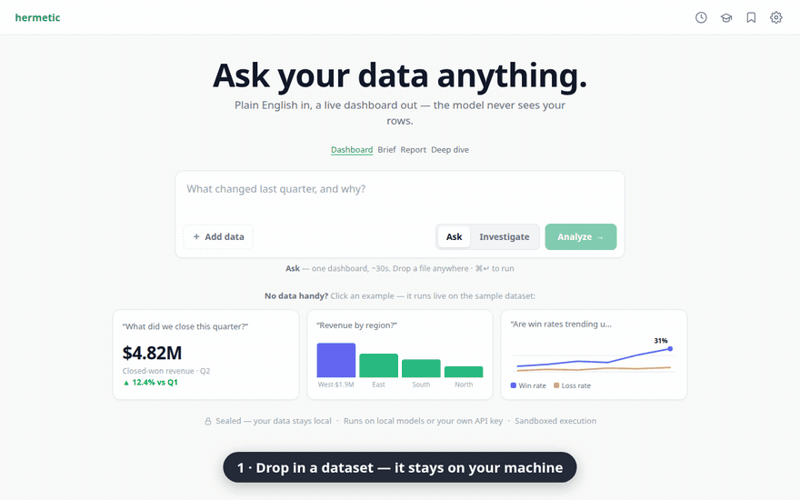
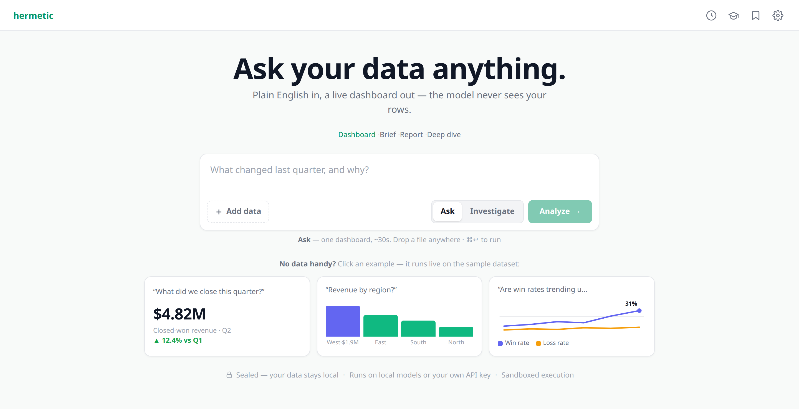
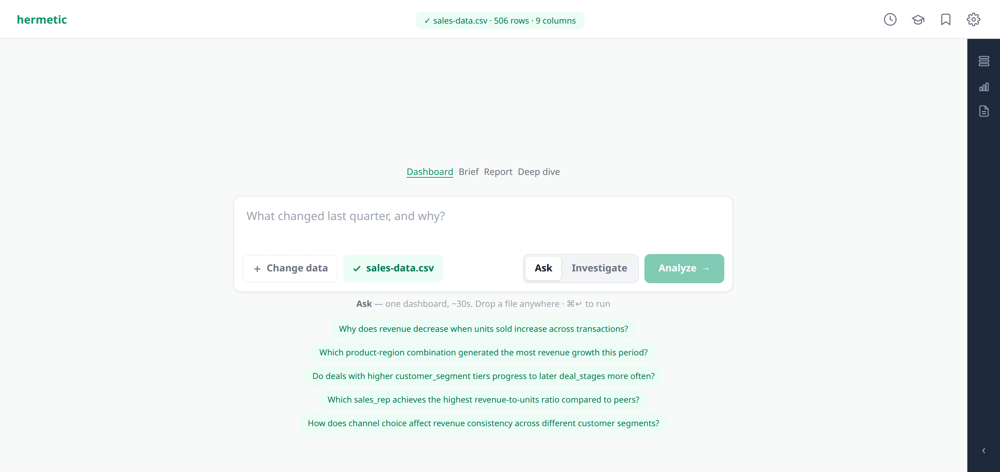
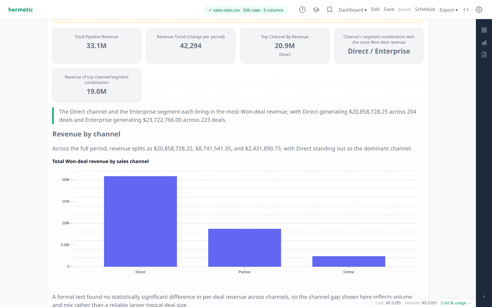
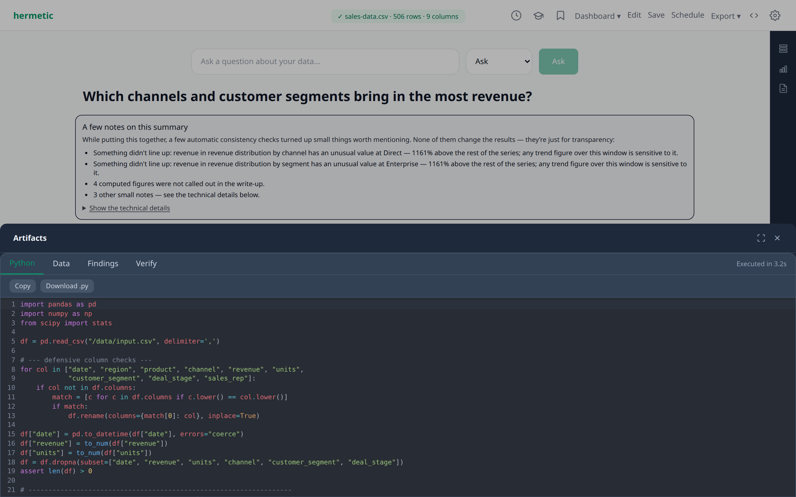
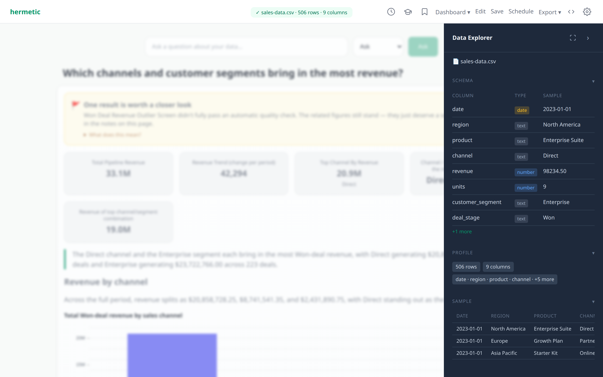
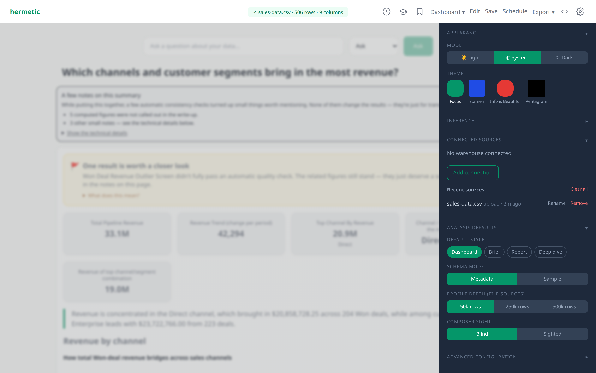
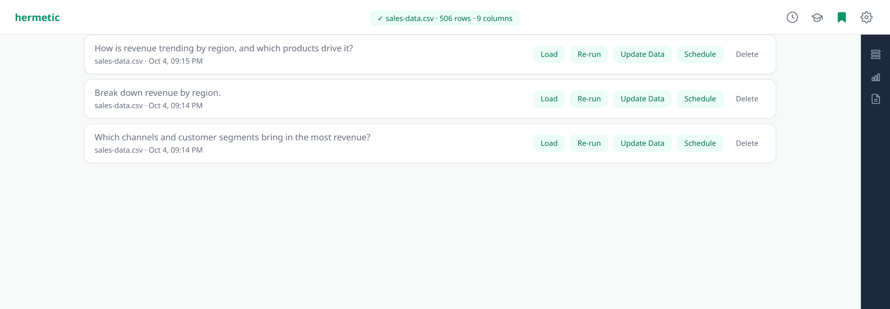

# Hermetic

Hermetic is an open-source AI data analyst that runs on your machine: ask a question of a spreadsheet, a Parquet file, or a warehouse and get an interactive dashboard, while the model writes the analysis code without ever seeing your rows ([what it does see](#what-the-model-sees)). The narrative's numbers are filled in by reference from what that code actually computed, a figure that traces to no computed value is flagged instead of stated as fact, and a Verify panel and an on-demand adversarial audit show the receipts.



What that guarantees is **numerical traceability** (each number traces to a computation on your data), not **analytical correctness** (that the analysis chosen was the right one). The analysis declares its findings and data-quality checks as typed claims you can inspect, but there is no public benchmark of answer quality yet ([Known limitations](#known-limitations)).

**What you'll see**

1. **Load data.** Drop in a CSV, Excel, GeoJSON, or Parquet file, browse to a local Parquet folder, point at cloud Parquet, connect a warehouse, or start from the bundled sample dataset.
2. **Ask.** Type a question in plain English, or pick one Hermetic suggests from your columns. The model writes Python (and SQL, for a warehouse), which runs in a sandbox on your machine with no route off it; a cloud source is reached only through an allowlist of its own host.
3. **Read the dashboard.** Charts, stat cards, and a short narrative, with the findings and checks the analysis declared. Open **Verify** to see each narrative figure traced to its computation, or run the **audit** to have a second model try to break the story against its own numbers.
4. **Keep going.** Ask follow-ups, edit the generated code and re-run, save and schedule a refresh, or export to PDF, DOCX, PPTX, or one self-contained interactive HTML file you can send to anyone.

**Beyond the first dashboard**

- **Sources:** local files and Hive-partitioned folders, cloud Parquet on S3/HTTPS, and PostgreSQL, BigQuery, ClickHouse, Snowflake, Databricks, Trino, and Hive.
- **Investigate:** a multi-step agent that splits one question into sub-questions and composes a single dashboard from the answers.
- **Models:** Anthropic, AWS Bedrock, Google Vertex, any OpenAI-compatible endpoint, your own Claude login through the Claude CLI, or local models (MLX, llama.cpp, Ollama).
- **Use it from Claude:** an [MCP server](#using-from-claude-mcp-server) lets Claude Desktop, Claude Code, or another MCP host drive the same pipeline while data and execution stay local.
- **Teach it your domain:** drop-in [skills](#skills--teach-it-your-domain) carry your team's definitions and tested helper code, and a curated [learning loop](#trust--verification) reuses past good runs.
- **Editable dashboards:** the optional [compiled composer](#philosophy) builds the dashboard deterministically from the declared claims, so you can reorder, hide, and add sections without another model call.















## Get Hermetic

**Recommended first run: the desktop app on macOS or Linux.** No Docker, no checkout.

1. Download it from the [latest release](https://github.com/achalp/hermetic/releases/latest): the macOS `.dmg` (Apple Silicon or Intel, Developer-ID signed and notarized) or the Linux AppImage, `.deb`, or `.rpm` (x86_64).
2. Give it a model, one of:
   - **A Claude Code login you already have.** If the `claude` CLI is installed and authenticated, Hermetic detects it and uses that login (Pro/Max subscription or API billing), with no API key to paste. [How it works](#claude-cli-use-your-own-claude-login-no-api-key).
   - **An API key** (Anthropic, or an OpenAI-compatible endpoint) in **Settings → Advanced Configuration**, stored in your OS keychain.
   - **A local model** (Ollama, llama.cpp, or MLX on Apple Silicon) from **Settings → Inference**, so nothing leaves your machine.
3. Choose **Use the sample dataset** (or drop in your own file) and ask a question.

The desktop app runs analysis in its built-in WebAssembly sandbox; if Docker is running it switches to the Docker sandbox, which handles larger data ([Sandbox runtimes](#sandbox-runtimes)). It updates itself from signature-verified releases, and every release asset is [build-provenance attested](ops/RELEASE.md) (`gh attestation verify <file> --repo achalp/hermetic`).

**Other ways in.** `hermetic.mcpb` from the same release installs into Claude Desktop by double-click (Settings → Extensions) and makes Claude a client of your local Hermetic ([MCP server](#using-from-claude-mcp-server)). A `git clone` plus [Quick Start](#quick-start) gives you the web app, CLI, MCP server, and Docker sandbox with everything inspectable.

### Platform support

| Entry point                               | macOS                                         | Linux                                       | Windows                                                                                                                                                         | Docker                                                           |
| ----------------------------------------- | --------------------------------------------- | ------------------------------------------- | --------------------------------------------------------------------------------------------------------------------------------------------------------------- | ---------------------------------------------------------------- |
| Desktop app, prebuilt                     | Yes: Apple Silicon + Intel, signed, notarized | Yes: x86_64 AppImage / `.deb` / `.rpm`      | **Experimental.** An installer is built and published every release, but it is not code-signed (SmartScreen warns) and has not been run by the maintainer or CI | Optional                                                         |
| `hermetic.mcpb` in Claude Desktop         | Yes                                           | Bundle boots in CI; no Claude Desktop check | **Experimental.** The bundle ships Windows binaries; untested                                                                                                   | Needed to run analysis; local connect and schema work without it |
| From a checkout: web app, CLI, MCP server | Yes                                           | Yes                                         | **Not supported** (bash setup script, POSIX shell syntax in `pnpm dev`, POSIX tool shell-outs). WSL2 is untested                                                | Web app: recommended. CLI and MCP server: required               |
| From a checkout: build the desktop app    | Yes                                           | Yes                                         | Exercised only by the release workflow                                                                                                                          | Not needed                                                       |

Every entry point also needs a model: an API key (Anthropic, Bedrock, Vertex, or OpenAI-compatible), a logged-in Claude CLI, or a local model. Claude CLI detection and local-model management shell out to `which` and `lsof`, which Windows lacks, so on Windows use an API key.

## Philosophy

Hermetic explores the idea that LLMs can generate correct data analysis code **without seeing the data itself**.

**Shape over samples.** Instead of sending rows to the LLM, Hermetic extracts the schema (column names, types, distributions, ranges, cardinality, correlations) and shares only that metadata as context. The LLM never sees data rows by default. Metadata is not nothing: it includes numeric and date ranges and the labels of categorical columns. Identifier-like columns (every value unique, or emails, phones, UUIDs, IPs) contribute their shape but never their values. The exact boundary is in [What the model sees](#what-the-model-sees). This keeps data private, reduces token usage, and forces the model to reason about structure rather than memorize values.

**Blind execution.** The LLM generates Python code but never sees the results. Code runs in an isolated sandbox, and the execution output (scalars, chart data, datasets) flows directly to the UI composition step. The LLM composing the dashboard works from result schemas and placeholders, not raw numbers. Every number displayed comes from actual computation on the real data. (A **composer sight** setting can optionally let the composer see computed values to sharpen phrasing — the binding discipline is unchanged either way, and the Verify panel records which mode ran.)

**Claims, not prose.** The generated analysis doesn't just compute — it **declares** what it found. `declare_finding` records each claim (name, typed value, plain-language definition) adjacent to the computation that produced it; `declare_check` records the data-quality checks the model designed for this dataset, with computed evidence, executed as code; `declare_series`/`declare_value` declare the chart data with **roles** (which column is time, which are measures, their units, the observation count, the raw-vs-screened variants, and how a measure re-aggregates from the source table — the recipe that lets a dashboard filter honestly instead of guessing). Narrative binds these claims (`$finding:` placeholders resolved server-side) instead of restating them, a lint battery cross-checks prose, results, charts, and claims against each other, and anything shipped that points at a declaration which doesn't exist — a cited finding, an executed screen, a methodological decision — is flagged or repaired before it reaches you.

**Statistics as total functions.** The judgment calls that make analyses subtly wrong — is a `$0.00` price a real value or an unrecorded-value sentinel? can a 52-observation year headline a series whose typical year has 600? is the mean valid under this skew? which correlation coefficient survives these ties? — are not left to per-run model discretion. A tested statistical runtime (`docker/sandbox/hermetic_runtime`) profiles every declared series into a **regime profile** (zero inflation, heavy tails, contamination, count skew, thin edges, short series, ties…), and a closed **regime matrix** — every claim type × every regime, all cells explicit, the rendered table generated from the code and drift-pinned by tests — maps each hazard to its response. Where possible the response is enforced _inside_ the claim function: sentinel zeros are excluded automatically when a measure's unit is monetary, trends become count-weighted least squares when observation counts exist, heavy-tailed group comparisons dispatch to Kruskal–Wallis, provably disordered series are refused rather than fit, and thin periods are gated by a relative attestation bar. The claim layer cannot disagree with the declared policy, and identical data cannot produce different verdicts run to run.

**Sandboxed execution.** Code runs in one of two sandboxes (compared in [Sandbox runtimes](#sandbox-runtimes)): Docker for the web app, CLI, and MCP server, or a WebAssembly sandbox inside the desktop app. Docker containers have no access to the host filesystem. Containers run with networking disabled (`--network none`) by default; network is enabled only when the generated code actually reads a remote data source (cloud Parquet over `s3://`/`https://`), and those runs use a fresh ephemeral container on an internal network behind a deny-by-default egress proxy, never the shared warm one. Data is passed in via stdin and results are read from stdout. The warm container is reused across queries for speed but clears working data between runs. Either runtime is held to what it can enforce: a run that needs a guarantee the active runtime can't provide is rejected rather than degraded, and runtimes that couldn't enforce network isolation (E2B, Microsandbox) were removed.

**Adaptive UI, two composer architectures.** Dashboards are declarative render specs (an owned, vendored fork of JSON-Render — `src/spec`): charts, stat cards, tables, annotations, and filters tailored to each question. Two composers can produce that spec, selectable in Settings:

- **Generative** (default): the LLM composes the layout freely from result schemas, with the lint battery and a bounded repair pass guarding the output.
- **Compiled**: one small LLM call **writes the document** — flowing analyst prose in which every figure must be a `$finding:` binding — and everything else is compiled deterministically. The plan is a typed grammar of speech acts (ANSWER / TREND / PEAK / ENDPOINT / CONTRAST / CAVEAT / INSIGHT) plus document structure (SECTION headings, chart EXPLAINERs, CALLOUTs, METHOD, CONCLUSION, NEXT_STEPS, LIMITS), and any node can **anchor** a chart so explainers sit above their figure and caveats sit exactly where they apply. A literal digit outside a binding is rejected; a caveat can only reference a declared check, so a fabricated mechanism has no syntax to exist in. When a node fails validation, **only that node degrades** to its template — the document survives. Charts derive from the declared series' roles via a **view catalog** (group matrices, unit-split axes, coverage companions forced in when thin-data regimes fire, precision tables for document styles), pair into two-column rows, carry human legend labels, and — when the analysis declares how a measure aggregates — come with **verified interactive filters** (below). Every style, however brief, carries the answer, its method, and a conclusion. Compiled dashboards are also what the editing surface edits. The block-by-block walkthrough is below.

The compiled path is walked through block by block, with what each output style (brief, dashboard, report, deep dive) changes and what it doesn't, in [docs/compiled-path.md](docs/compiled-path.md).

## What the model sees

"Never sees your rows" is a claim about a specific boundary. Here is what crosses it.

| Sent to the model                                                                                                        | When                                       |
| ------------------------------------------------------------------------------------------------------------------------ | ------------------------------------------ |
| File name, column names, types, row count, null counts, correlations                                                     | Always                                     |
| Numeric min/max/mean/percentiles; date ranges                                                                            | Always                                     |
| Categorical labels: all of them if a column has ≤ 30 distinct values, else the 10 most frequent that repeat, with counts | Always — except identifier-like columns    |
| Identifier-like columns (every value unique, or an email / phone / UUID / IP pattern): distinct count and pattern only   | Values are **never** sent                  |
| Result schemas and placeholders (not computed numbers)                                                                   | Always                                     |
| Computed values (to sharpen phrasing)                                                                                    | Only with **composer sight** on (Settings) |
| Computed values and the rendered dashboard (never rows)                                                                  | Only when you run the on-demand **audit**  |
| 5 real sample rows and per-column sample values                                                                          | Only in **sample** schema mode (opt-in)    |
| Warehouse rows returned by MCP `run_sql` (default 200, max 1,000)                                                        | Only when an MCP host model calls it       |

Two things to know: a column with ≤ 30 distinct values lists every label even in a small file, which is how the model learns a dimension's categories; and a warehouse connection sends table and column names (plus dbt descriptions if present) to generate SQL. There is no mode that withholds category labels: without them the model cannot write an exact filter like `plan == "Pro"`. If the labels themselves are sensitive, treat them as sent, and use a local model.

**Who receives it** depends on the provider you pick. With a local model (MLX, llama.cpp, Ollama) nothing above leaves your machine, and Hermetic runs offline apart from map tiles (OpenFreeMap), the desktop app's update check (GitHub Releases), model downloads you start, and remote data sources you connect. With a cloud API (Anthropic, Bedrock, Vertex, an OpenAI-compatible endpoint) or the Claude CLI, the rows marked above go to that provider under its terms. Hermetic has no telemetry of its own.

**What stays on your machine**, under the data directory (`data/` in a checkout; the app-data directory for the desktop app): analysis history with generated code and computed results (`history/`), per-run journals and diagnostics (`runs/`, `diagnostics/`), cost logs (`cost/`), saved dashboards, the MCP audit log (`mcp-audit.jsonl`), and learning exemplars from past runs (`learning/`). Uploaded files are staged in a scratch directory under the OS temp dir and evicted when idle. `retention` in `data/runtime-config.json` caps history and run records. An exported HTML dashboard contains the data it shows, by design, so share it like the data.

## Quick Start

From a checkout on macOS or Linux (Windows is not supported from source; see [Platform support](#platform-support)). Prerequisites: Node 20.9+, pnpm (via Corepack), Docker for the default web-app runtime, and a model.

```bash
git clone https://github.com/achalp/hermetic.git
cd hermetic
./start.sh
```

The setup script checks prerequisites, installs dependencies, sets up the Docker sandbox, and starts the dev server. It then asks which model to use: an API key (Anthropic, Bedrock, Vertex, or an OpenAI-compatible endpoint), your own Claude login through the [Claude CLI](#claude-cli-use-your-own-claude-login-no-api-key) with no key to paste, or a local model. When `claude` is on your `PATH`, the Claude login is the default. For CI or scripted setups, `./start.sh --headless` (or `-y`) accepts defaults and skips every interactive question.

It also offers to connect hermetic to Claude Desktop / Claude Code as an MCP server — see [Using from Claude](#using-from-claude-mcp-server).

### Two ways to run Hermetic

There are two runtimes, from one codebase:

- **Web app + Docker** — what `./start.sh` sets up by default. The dev server plus a Docker sandbox for executing analysis code. Best for development and for machines that already run Docker.
- **Embedded desktop app** — a single platform executable (Tauri) that runs the analysis in a **WebAssembly sandbox (Pyodide + DuckDB-WASM), no Docker required**. This is the download for non-technical users.

The two sandboxes enforce isolation differently; [Sandbox runtimes](#sandbox-runtimes) compares them.

`./start.sh` (from a clone) asks up front which you want:

| Choice                              | What runs                                                            | Docker? |
| ----------------------------------- | -------------------------------------------------------------------- | ------- |
| **1) Desktop app**                  | the built native executable (embedded WASM runtime)                  | no      |
| **2) Desktop app — dev mode**       | `pnpm desktop:dev` (`tauri dev`): Next dev server + the Tauri window | no      |
| **3) Web app + Docker** _(default)_ | the current dev server + Docker sandbox                              | yes     |

Pressing Enter (or `--headless`) keeps the default (**3**), so nothing about the existing flow changes.

**Build the desktop executable yourself** (needs the Rust toolchain + your OS's webview dev headers):

```bash
pnpm desktop:build     # egress-fetch (release) → tauri build → src-tauri/target/release/bundle/
pnpm desktop:dev       # or run it in dev mode (Next dev server + Tauri window)
```

A `tauri build` produces a **per-OS** installer and must be run **on each target OS** (native webview + code signing are per-platform); prebuilt downloads for Linux, macOS (both arches), and Windows are published from the releases page — updater-signed and provenance-attested; macOS builds are Developer-ID signed + notarized, Windows is **not yet OS code-signed** (SmartScreen will warn on first open; see [`ops/RELEASE.md`](ops/RELEASE.md)) and is experimental: built by the release workflow, never run there or by the maintainer ([Platform support](#platform-support)).

**Installed-app logs** live in the OS app-data dir under `logs/sidecar.log` (5 MB, one `.old` generation) — macOS: `~/Library/Application Support/com.hermetic.desktop/`, Linux: `~/.local/share/com.hermetic.desktop/`, Windows: `%APPDATA%\com.hermetic.desktop\`. Run artifacts (`data/runs/<id>/journal.jsonl`, `data/diagnostics/`) live next to it.

### Manual Setup

1. **Install dependencies**

   This project uses [pnpm](https://pnpm.io). Enable it with Corepack (bundled with Node), then install:

   ```bash
   corepack enable
   pnpm install
   ```

   The committed `pnpm-lock.yaml` is registry-agnostic, so it installs cleanly against the public npm registry or a corporate mirror (e.g. Artifactory) configured in your `~/.npmrc`.

2. **Configure environment**

   ```bash
   cp .env.example .env.local
   ```

   Add credentials for your LLM provider (Anthropic API key, AWS credentials, or GCP project). See [Configuration](#configuration). For local-only usage with Ollama, no `.env.local` changes are needed. Configure it from the Settings UI instead.

3. **Set up the sandbox** (Docker — the web app's runtime; the desktop app needs none):

   ```bash
   docker build -t hermetic-sandbox docker/sandbox
   ```

   Requires [Docker Desktop](https://www.docker.com/products/docker-desktop/) or a native Docker engine. Release builds are also published as `ghcr.io/achalp/hermetic-sandbox`.

4. **Start the dev server**

   ```bash
   pnpm dev
   ```

5. Open [http://localhost:3000](http://localhost:3000)

## Features

### For Non-Technical Users

- **Ask your data anything.** Type a question in plain English — no SQL, no code, no formulas.
- **Conversational follow-ups.** Hermetic keeps conversation context server-side. "Exclude outliers and re-run", "break that down by quarter", "compare to last year" all work without re-explaining the setup.
- **Suggested follow-ups.** After a fresh analysis, inline pills suggest the next obvious questions based on what just came back.
- **Smart question suggestions.** After loading data, the LLM analyzes your schema and suggests specific, insightful questions tailored to your actual columns and patterns.
- **Try with sample data.** One-click sample dataset to explore Hermetic without needing your own data.
- **Start in one drag.** Drag a file straight onto the home screen (or click to browse), and see real example dashboards — the kind Hermetic generates — before you upload anything. The start screen leads with the privacy guarantee: the model writes the analysis code, but never sees your rows.
- **Show your work.** Every analysis includes a plain-English methodology explanation — how many rows were analyzed, which columns were used, what operations were performed.
- **Grounded numbers.** Every figure in a dashboard's narrative is checked against what the analysis actually computed; any number that traces to no result is flagged with a "verify this" caveat instead of being presented as fact. Applies to both single-shot dashboards and Investigate.
- **Filters that recompute, not re-average.** A compiled dashboard's filter controls are derived, never written by a model: a series that declared a dimension gets a filter bar, and when the analysis also declares **how a measure aggregates** (e.g. a rate is `sum(churned)/sum(active)`, never the average of per-group rates), the chart is rebuilt from the source table on every change — including by dimensions its own aggregated rows never carried. The recipe is replayed against the declared rows before any control ships; if it doesn't reproduce them exactly, the chart stays static and the disagreement is logged. Each filter bar states what it governs.
- **Four output styles.** Choose how results are framed: Dashboard (at-a-glance grid), Brief (bottom-line-up-front), Report (formal sectioned document), or Deep dive (exhaustive multi-angle). Slides (PPTX / Reveal deck) is an export format. The style is stamped into each analysis' record, so a restored dashboard's style picker always shows what it was actually run with. In compiled mode the style also scales narrative depth and which charts ship (a deep dive narrates every claim with signal; a brief stays on the bottom line).
- **Edit the dashboard.** On compiled dashboards, an **Edit** toggle opens a panel: drag sections to reorder, hide or show any element, edit the synthesis paragraph, narrate a claim the story skipped, or add a chart from the derived catalog (each candidate view explains why it exists). Edits recompile instantly with no LLM call and persist with the analysis.
- **Light / Dark / System mode.** Toggle between light and dark themes, or follow your OS preference.

### Trust & Verification

- **Declared findings and checks.** The analysis declares what it found and which data-quality checks it ran — as typed claims with computed evidence, not prose. Failed checks surface as a banner and bindable caveats; a "blocking" check that fails gates the run's results as unvalidated instead of shipping them quietly.
- **Regime-aware statistics.** Sentinel zeros, thin trailing periods, heavy tails, mixed currencies, disordered axes — each declared series is profiled and the hazards are answered inside the statistics library itself (see [Philosophy](#philosophy)), with the applied policy disclosed in the output (`n_zero_excluded`, attestation bars, `weighted` fits, which test ran).
- **Verify panel.** Every analysis carries a machine-readable verifiability record — composer mode, findings declared vs. cited, failed checks, headline tiles planned vs. delivered, prose advisories, and a grounding report tracing each narrative figure to its computation. Exportable as JSON.
- **Non-blind audit.** One click runs an adversarial review over the derived artifacts (never raw rows): a second model tries to break the dashboard's story against its own numbers. The verdict persists as part of the analysis record and survives restore — it has caught real miscalibrations the lint battery shared blind spots with.
- **Lint battery + bounded repair.** Dozens of coherence lints cross-check narrative, results, charts, and claims — dangling citations, silently executed screens, orphaned methodological decisions, unit mismatches, contradictory verdicts, thin-data headlines. Severe narrative defects trigger one bounded recompose pass with explicit repair instructions; the rest surface as advisories.
- **Curated learning.** Successful runs can seed future ones as exemplars — but only through a quality gate (runs with severe lint findings are vetoed from teaching) and a `/learning` page where you review and curate what the engine keeps.

### Agentic Analysis

- **Investigate agent.** One question, a full deep-dive. The planner decomposes it into a few focused, penetrating sub-questions — the count scaled to the output style (a Brief stays tight at ~3; a Deep dive goes wide) — the orchestrator runs independent ones in parallel waves and dependent ones serially, and a composer synthesizes them into a single unified dashboard. Against a **data warehouse**, each sub-question generates its own targeted SQL that aggregates server-side over the full population (no row-cap sampling bias), bounded to a scan window sized from engine metadata so a billion-row table never blows the read limit. Progress streams live as a step list with status icons. The planner sees schema and stats only — never row values. Results render as a unified dashboard or as a step-by-step **notebook view** (each step's question, code, and result as a cell), exportable to Markdown, HTML, PDF, or Slides.
- **Per-run diagnostics.** Every Investigate (and Ask) run writes one structured JSON record to `data/diagnostics/<date>.jsonl` — materialization (rows, sampled, Parquet, SQL repairs), per sub-question (path, escalations + reason, retries + error classes, status), an aggregate summary, plus cost and call count. A `/diagnostics` page aggregates the records — runs per day, failure modes ranked by frequency, escalations, recent failures with run ids — so "why did this run cost or behave this way" is answerable from data, not guesswork.
- **Multi-retry with reflection.** When generated code fails, the pipeline retries up to three times, carrying the full history of failed attempts forward. A reflection prompt kicks in after two failures so the model sees what it tried and why it broke, not just the original prompt.
- **Scheduled runs.** Saved dashboards can be scheduled with node-cron. Schedule popover anchored to the dashboard toolbar, schedule pills on saved-viz cards with edit/delete in place — a dashboard you built last week refreshes itself every Monday morning.
- **Persistent history.** Every analysis auto-saves to disk (generated code, results, visualizations, the verifiability record, and any audit verdict — one record, no side-files). History survives restarts. Browse from a dedicated page, restore any previous result instantly, or re-run it against fresh data. Saved visualizations record the history entry they came from, so a restored viz keeps its audit and provenance.
- **URL-addressable views.** Browser back/forward walks the app's own transitions (results → data → home), and a results URL carries its reconstruction key — paste it in a new tab and the analysis restores.

### Skills — teach it your domain

- **Drop-in skills.** A skill is a folder — `data/skills/<name>/SKILL.md` — that teaches the engine a domain: activation triggers (column-name regexes, question keywords, data-source kind), prompt guidance, reviewer rules, and failure hints for the retry loop. Drop it in and it's live on the next question — no restart, no rebuild. Invalid files are skipped with a logged reason, and `GET /api/skills` lists every skill plus every rejected file with why.
- **Python helpers.** A sibling `helpers.py` ships into the sandbox as `skill_lib.<name>` when its skill activates. Function signatures and docstring first-lines are auto-advertised in the prompt — generated, not hand-written, so the prompt can never advertise a function the module doesn't define — and the model imports tested code instead of re-deriving formulas. `data/user_lib/*.py` modules preload on **every** run for team-wide metrics and loaders.
- **Built-in skills.** The engine's own geo expertise ships the same way: Overture polygon hydration, planet-scale superlatives (Parquet-footer coarse-to-fine scan + KD-tree), and map answer visibility are built-in skills activated per question — the critic, router, and guards stay domain-agnostic.
- **Pre-execution review gate.** An LLM critic lints generated code against the active skills' rules **before** it runs (won-only revenue, no OR'd bounding-box scans, significance before declaring an A/B winner, …) and forces a regeneration on findings — cheaper than paying for a doomed two-minute scan.
- **Worked samples.** Five sample skills ship in [`samples/skills/`](samples/skills/): sales correctness guards, cohort retention, A/B experiment readouts, anomaly windows, and spatial clustering (the Clark-Evans index via scipy as a preloaded helper). Full authoring guide: [`docs/creating-skills.md`](docs/creating-skills.md).

### Data Sources

- **File uploads.** CSV, Excel (multi-sheet workbooks with relationship detection), GeoJSON, JSON.
- **Parquet and DuckDB.** Local Parquet files and Hive-partitioned folders, with a file browser to pick them. Files bind-mount directly into the sandbox (zero-copy). For datasets over ~1M rows, aggregation is pushed into DuckDB SQL before touching pandas.
- **Data warehouses.** PostgreSQL, BigQuery, ClickHouse, Snowflake, Databricks, Trino, Hive. SQL generated automatically from natural language, with cross-table JOINs and dialect-aware prompt guidance.
- **dbt metadata enrichment.** If a dbt project is wired up, column-level descriptions are pulled into the LLM context alongside the warehouse schema.
- **Saved connections.** One-click reconnect to previously used warehouses — visible directly in the connection card. Per-warehouse tabs and color codes in the UI.
- **Data explorer.** Collapsible right-side rail showing schema (column names, types, samples), data profile (row counts, distributions), and sample rows. Supports Excel sheet tabs and warehouse table navigation with split-panel layout.

### Visualization

- **57 chart types.** Core (bar, line, area, pie, scatter, histogram, box, violin, heatmap); financial & KPI (candlestick, waterfall, funnel, gauge, bullet, dual-axis); flow & hierarchy (sankey, chord, treemap, sunburst, marimekko); statistics (Pareto, QQ, ECDF, survival/Kaplan–Meier, forest, control/SPC, correlogram, error bars/CI); ML (confusion matrix, ROC, calibration, lift/gain, partial dependence, SHAP beeswarm, dendrogram, silhouette, decision tree, network graph); and scientific/temporal (contour, ternary, population pyramid, Gantt, cohort grid, quiver, wind rose, calendar, stream, ridgeline, bump, radar, dumbbell, slope, beeswarm, sparkline, parallel coordinates).
- **3D visualizations.** Scatter3D, Surface3D, Globe3D, deck.gl maps.
- **Geographic maps.** MapLibre GL vector tile maps with GeoJSON overlays, deck.gl layers (hexagon, column, arc, scatterplot, heatmap) with click/hover interactivity.
- **Interactive pivot tables.** Sort, drill-through, drill-down, cross-filter against other widgets on the same dashboard, aggregator switcher, heatmap mode, multi-value and multi-aggregator support.
- **Adaptive dashboards.** The LLM composes layouts tailored to each question — bar charts for comparisons, line charts for trends, stat cards for KPIs.
- **Drill-down navigation.** Click chart segments to explore deeper.
- **Client-side filtering.** DataController enables instant cross-filtering across dashboards.
- **Expanded mode for every chart.** Chart components support full-height expanded rendering; labels truncate with tooltips instead of overlapping; WCAG-compliant font sizes throughout.

### Operations

- **Edit and re-run.** If the generated Python or SQL is 90% right, edit it directly in the code editor and rebuild the whole dashboard through the standard pipeline. The server skips the generation step for whichever artifact you edited and runs everything downstream.
- **Save and export.** Save visualizations; export as PDF, DOCX, PPTX — or as a **single-file interactive HTML** dashboard (see [Sharing dashboards](#sharing-dashboards)). Individual charts downloadable as PNG.
- **Artifacts viewer.** Bottom sheet panel with syntax-highlighted SQL, Python code, and computed data tables. Copy to clipboard or export as CSV/XLSX.
- **Update data.** Re-run saved visualizations with new data files. Schema-compatible updates skip LLM calls.
- **Cost tracking.** Every analysis' LLM token cost is captured automatically across the whole fan-out (code-gen, retries, planner, sub-questions, compose) with zero call-site threading, and surfaced three ways: a live footer (last analysis + running session total), a per-day CSV log (`data/cost/<date>.csv` with token buckets, per-analysis cost, and a **per-phase breakdown** — planner, SQL-gen, SQL-repair, code-gen, compose, …), and a `/cost` page with totals and a per-dataset breakdown, linked from Settings. Local or unknown models report $0 but still track tokens.
- **Cost-optimized by default.** Prompt caching (Anthropic ephemeral cache — roughly a 90% input discount on cache hits) wraps the large static prompts that every compose call re-sends, plus cheaper models for heavy vs. classification work, fewer retries, lazy cell composition, output volume scaled to the chosen style, and — for warehouse Investigate — per-step SQL that aggregates in the warehouse so code-gen runs over a small result instead of a million-row frame. The wins are largest on Investigate, which fans out into many LLM calls; per-phase cost telemetry is what made each lever measurable.
- **Resilient long runs.** Planet-scale analysis won't OOM-kill the sandbox: a memory watchdog polls the container 4×/second, an up-front feasibility gate refuses a plan that already can't fit, DuckDB is capped to the container's real limit (scan threads included), `.df()` pulls are hard-capped so an unguarded materialization can't take out the container, and the coarse-to-fine scan counts candidate cells instead of materializing them. A preflight lint catches forgotten imports before execution; when a run does die, the retry carries a **phase-accurate** signal — which progress phase was executing, plus any skill-provided remedy — instead of a generic OOM blob. The app holds a wake lock during execution so a sleeping laptop doesn't sever a long remote scan, an in-flight run survives a browser reload or dev hot-reload, and **Stop actually stops** — it kills the in-flight LLM call and the sandbox process, not just the spinner. Code-gen and retries stream into the progress panel live, and each attempt's diagnostics (config, phase, output tails) persist to the run directory.

### Configuration

- **Multiple LLM providers.** Anthropic, AWS Bedrock, Google Vertex AI, OpenAI-compatible endpoints, or the **Claude CLI** — use your own `claude` login (Pro/Max subscription or API billing) with no API key. The Claude 5 family (Sonnet 5, Opus 5, …) is selectable per task: separate model pickers for code generation and dashboard composition.
- **One golden source for settings.** Model choices, sandbox runtime, composer architecture, and effort levels live in `data/runtime-config.json` and are resolved server-side for **every** harness — web, MCP, and CLI always run the same configuration (the browser is a mirror, not a second store).
- **Per-phase reasoning effort.** Set one global effort level, or override it per pipeline phase (code-gen vs. compose vs. review vs. planning) from Settings — analytical phases can think hard while classification stays cheap.
- **Composer architecture.** Switch between the generative and compiled composers from Settings (see [Philosophy](#philosophy)); the compiled path is what enables deterministic recompiles and dashboard editing.
- **Local models.** MLX (Apple Silicon), llama.cpp, or Ollama. Detect, download, and activate models from the Settings drawer.
- **Four themes.** Focus (emerald, default), Stamen (cartographic), Info is Beautiful (vivid), Pentagram (reductive). Each with light and dark variants.
- **Sandbox runtime.** Docker or the built-in WebAssembly sandbox (no Docker), selectable in Settings — see [Sandbox runtimes](#sandbox-runtimes) for what each enforces. The capability gate fails closed: a run that needs isolation the active runtime can't provide is rejected, never silently degraded.

## Using from Claude (MCP server)

Hermetic doubles as a [Model Context Protocol](https://modelcontextprotocol.io) server: any MCP host — Claude Desktop, Claude Code, or another MCP-speaking agent — gets hermetic's pipeline as tools while data, execution, and dashboards stay on your machine.

- **17 tools**: `analyze` (the full pipeline as one call, with `composer_sight` and output-style options), `analyze_start`/`analyze_status`/`analyze_result`/`analyze_cancel` (the same pipeline as a background job with long-poll progress — for hosts that cancel long tool calls), `connect_source`, `get_schema`, `run_sql`, `run_analysis` (host-authored Python in the sandbox), `verify_narrative`, `audit_analysis` (the on-demand non-blind audit as a tool), `get_dashboard_plan` / `edit_dashboard` (read a compiled dashboard's edit surface — sections, un-narrated claims, the derived view catalog — and edit it through the same governed mutation grammar as the web UI), `persist_dashboard`, `export_dashboard`, `list_sources`, plus `dashboard_data` (internal, app-only — feeds the inline MCP Apps viewer).
- **Embedded viewer**: dashboard links work with nothing else running (loopback-only server inside the MCP process), with the app's full theming and a download button.
- **Inline dashboards (MCP Apps)**: hosts that support the [MCP Apps extension](https://modelcontextprotocol.io/seps/1865-mcp-apps-interactive-user-interfaces-for-mcp) (Claude Desktop, VS Code, Goose) render `analyze`/`persist_dashboard` results as an interactive dashboard **inside the chat** — the spec travels as `structuredContent` to a sandboxed iframe (never into model context), and the viewer template is fully self-contained (no external requests). Text-only hosts see exactly the old JSON responses.
- **Trust model**: guards sit on authorship — host-written SQL passes a read-only gate before any connector sees it, host-written Python runs with networking denied, host-written specs validate against the catalog in enforcing mode. Every call lands in an audit log; the egress allowlist is proven in CI by an exfiltration canary.
- **Setup**: `./scripts/install-mcp.sh` (detects Claude Desktop/Code, asks, writes config, builds the viewer). Claude Code needs nothing inside this checkout — the repo's `.mcp.json` auto-prompts. Or skip the checkout entirely: every [GitHub Release](https://github.com/achalp/hermetic/releases) ships **`hermetic.mcpb`** — a one-file MCP bundle (server, viewer, Python runtime assets, keychain bindings for 7 platforms, the Rust egress-core binary for 5, and the in-process DuckDB engine) that installs into Claude Desktop by double-click.

Full tool reference, trust model, and observability guide: [docs/mcp.md](docs/mcp.md).

## Sharing dashboards

Any analysis exports as **one self-contained `.html` file** — spec, data, renderer, charts, themes, and fonts inlined. It opens in any browser from `file://`, offline, with full interactivity (filters, cross-filter, drill-down), and needs no server, hosting, or account. Send it over Slack or email, or drop it on a shared drive.

- ~3 MB for typical dashboards (the exporter inlines only the chart families the spec uses; 3D/geo/finance dashboards are larger) — the size and bundle are reported at export time.
- Available from the web app's export menu ("Interactive HTML"), the CLI (`hermetic render <history-id> --html out.html`), and MCP (`export_dashboard`, plus an `export_url` on every `analyze` response).
- The exported file strips pipeline-internal state, carries an as-of watermark and the verbatim question, and contains only what the dashboard shows.

Design and rationale: [`specs/dashboard-distribution-2026-08-05.md`](specs/dashboard-distribution-2026-08-05.md).

## Data Warehouses

In addition to file uploads, Hermetic can connect directly to data warehouses. Ask questions in natural language and Hermetic generates SQL automatically, executes it against your warehouse, then analyzes and visualizes the results.

Supported warehouses: **PostgreSQL**, **BigQuery**, **ClickHouse**, **Snowflake**, **Databricks**, **Trino**, **Hive**.

### Connecting

On the home screen, the **Connect a warehouse** card shows your saved connections as one-click pills. Click one to connect instantly. To add a new connection, click the card and fill in the type-specific form (host, port, credentials). Hermetic introspects all tables (columns, types, primary keys, foreign keys) so the LLM can generate cross-table JOINs.

Credentials are saved automatically after a successful connection. Saved connections are managed from the Settings drawer.

### How it works

```
User asks question
    → LLM generates dialect-aware SQL (bounded to a metadata-sized scan window)
    → Server executes it — self-healing on engine errors (repair + retry)
    → Results flow as CSV into the existing pandas pipeline
    → Analysis code runs in sandbox → interactive dashboard
```

The SQL is available in the **Artifacts** panel (SQL tab) alongside the Python analysis code.

### Warehouse queries are hardened — and Investigate goes further

**Every** warehouse query — single-shot **Ask** and multi-step **Investigate** alike — runs through the same shared hardening, so a billion-row table doesn't sink it:

- **Bounded scan from engine metadata (not a data scan).** Before generating SQL, Hermetic sizes a recent window from metadata — ClickHouse `system.tables` sort-key bounds, BigQuery `INFORMATION_SCHEMA.PARTITIONS` (partition values + row counts), with a `MIN/MAX` fallback on a real date column — and hands that exact window to SQL-gen so the query never trips the read/byte limit.
- **Self-healing SQL.** A failed query is repaired by feeding the exact engine error back to the model — bad GROUP BY, memory blowup, a too-wide scan (`rows to read exceeded`), an empty result from a dead partition filter — and retried. Co-occurrence/pairwise questions are steered to array collapse + `ARRAY JOIN` instead of fact-table self-joins.
- **Byte-budget result streaming.** Postgres, ClickHouse, BigQuery, and Databricks stream query results row-by-row under a byte budget, so an unexpectedly wide result aborts cleanly at the limit instead of OOM-killing the server after buffering gigabytes; buffered connectors get the same budget as a backstop cap.
- **Read-only SQL gate — but connect with a read-only role.** Every generated query passes `assertReadOnlySql` (single SELECT/WITH only; write/DDL keywords, `SELECT … INTO`, multi-statement tails, `EXPLAIN ANALYZE`, and filesystem/network functions like `pg_read_file`/`dblink`/`lo_import` are rejected anywhere in the statement). This is defense-in-depth, not the boundary: **create a dedicated read-only role and connect as that**, so the database itself forecloses writes. For PostgreSQL:

  ```sql
  CREATE ROLE hermetic_ro LOGIN PASSWORD '…';
  GRANT CONNECT ON DATABASE mydb TO hermetic_ro;
  GRANT USAGE ON SCHEMA public TO hermetic_ro;
  GRANT SELECT ON ALL TABLES IN SCHEMA public TO hermetic_ro;
  ALTER DEFAULT PRIVILEGES IN SCHEMA public GRANT SELECT ON TABLES TO hermetic_ro;
  ```

  The examples in [docs/warehouses.md](docs/warehouses.md) use a superuser only for brevity; do not do that in production.

**Investigate adds more for its fan-out:**

- **Bounded materialization + per-step SQL.** It materializes one bounded snapshot for planning, then each sub-question generates its **own** targeted query that aggregates server-side over the full population (no row-cap sampling bias), returning a small result — code-gen runs over kilobytes instead of a million-row frame.
- **Large pulls via Parquet + DuckDB.** A big materialized pull is converted to Parquet and analyzed through DuckDB before pandas — raising the in-memory ceiling well past a million rows, fallback-safe to CSV. When the snapshot is a capped sample, the dashboard discloses it.

Tested end-to-end against live public warehouses (ClickHouse Playground, BigQuery public datasets).

Per-engine connection fields and local test setups (PostgreSQL, ClickHouse, BigQuery, Snowflake, Databricks, Trino / Hive): [docs/warehouses.md](docs/warehouses.md).

## Parquet and Local Files

Point Hermetic at a Parquet file or a Hive-partitioned folder on your local disk and analyze it without uploading.

Click the **Browse local files** entry on the home screen, navigate to the file or folder, and pick it. With Docker the file is bind-mounted into the sandbox (zero-copy — no upload, no conversion); the desktop app's WebAssembly sandbox converts it host-side and delivers it instead. DuckDB extracts schema and statistics; for queries over ~1M rows, aggregation is pushed into DuckDB SQL before any pandas code runs.

Hive-partitioned folders (e.g. `year=2024/month=01/...`) are detected as a single dataset; partition columns appear in the schema alongside the file columns.

## Command line

The CLI drives the same pipeline with no web server:

```bash
pnpm cli ask "What is the MRR trend over time?" data.csv --out spec.ndjson
pnpm cli render <history-id> --html dashboard.html   # single-file export
```

`ask` streams the analysis as NDJSON patches and persists it to history; `render` exports a persisted entry as a self-contained interactive HTML file. Reference: [docs/cli.md](docs/cli.md).

## Architecture

```
src/
  app/                  Next.js harness (App Router)
    api/                ~60 thin route handlers delegating to lib
      query/            Ask + Investigate streaming endpoints (NDJSON patches)
      upload/, local-files/, remote-parquet/   File & Parquet ingestion (shared lib/sources/ingest)
      warehouse/        Connection, introspection (cached + FK inference), sample
      vizs/, history/   Saved visualization CRUD + scheduling; persistent history
      export-html/, export/[id]/   Single-file interactive HTML export
      skills/, diagnostics/, cost/, health/, providers/, runtimes/, local-llm/
    components/         Application UI (top bar, settings, data rail, panels, home)
    lib/                Browser-side app plumbing (typed API client, client-log bridge)
    diagnostics/, cost/, history/   Operational pages
  components/           The renderer library (future @hermetic/renderer — CI-checked closure)
    charts/             57 chart components (Nivo, Plotly, deck.gl, MapLibre GL)
    controllers/        DataController for client-side filtering
    inputs/             Form inputs
    theme/              Theme system (4 themes × light/dark; shared with viewer + export)
    registry.tsx, spec-view.tsx, data-table.tsx, pivot-table.tsx
  spec/                 Vendored spec system fork (future @hermetic/spec — bottom of the stack)
  lib/                  Framework-free core (no Next, no React — lint-enforced)
    contracts/          Owned shared types (stream protocol, requests, schemas, configs)
    csv/, excel/, geojson/, parquet/, local-files/   Parsers & schema extraction
    sources/            Shared ingestion seam (upload, local-files, MCP all consume it)
    warehouse/          Connectors (postgres, bigquery, clickhouse, snowflake, databricks,
                        trino, hive), read-only SQL guard, engine descriptors, cached
                        introspection + FK inference, dbt metadata
    sqlgen/             Dialect-aware SQL generation + self-healing repair
    llm/                LLM client & transports (incl. Claude CLI), prompts, planners/composers
    findings/           Declared-findings grammar: validation, coherence lints (the battery),
                        manifest projection, headline planning
    product/            Analysis Product: declared series/values with roles, the Binding
                        Catalog, component role signatures, roles index
    compose/            The compiled composer: plan/document DSL + validator and
                        per-node salvage, planner call, deterministic realizer, view
                        catalog, derived filter controllers with baseline replay
                        verification, scaffold, mutation grammar, edit surface
                        (specs/narrative-compiler-2026-08-09.md)
    learning/           Exemplar bank + quality veto (user-curated at /learning)
    skills/             Skill system: triggers, guidance, review rules, helpers (docs/creating-skills.md)
    pipeline/           Orchestration: Ask/Investigate runners, retry loops, review gate,
                        patch streaming, run control, grounding verification, audit, caches
    sandbox/            Execution: Docker and the wasm tier (Pyodide + DuckDB-WASM), per-runtime
                        capability descriptors, egress allowlist (CI-proven exfiltration canary), lifecycle
    export/             Single-file HTML export assembler
    history/, saved/, cost/, diagnostics/   Persistence, scheduling, cost capture, run records
  cli/                  CLI harness (ask, render) — the architecture canary, runs in CI
  mcp/                  MCP server harness: 17 tools, audit log, error taxonomy,
    viewer/             embedded dashboard viewer + export bundles (esbuild, no Next)
  harness/              Boot seam shared by non-Next harnesses (env config snapshot)
docker/sandbox/
  hermetic_runtime/     The tested Python statistical runtime shipped into every sandbox run:
                        declare_finding/declare_check/declare_series, the claim library
                        (finding_trend, finding_superlative, finding_current_state, …),
                        regime profiling + the closed regime matrix (regimes.py), guards,
                        output envelope — pure-python exact p-values, ~100 unit tests
specs/                  Design records with principal-engineer/data-scientist reviews —
                        declared findings, analysis product, regime matrix (the generated
                        matrix table is drift-pinned by tests), narrative compiler
```

### How It Works

**File uploads:**

1. **Load.** CSV, Excel (multi-sheet), GeoJSON, JSON, or Parquet file is parsed, schema extracted, and stored in memory (Parquet stays on disk and is bind-mounted into the sandbox).
2. **Query.** User question + schema (and prior conversation history, if any) sent to your configured LLM for Python code generation, along with guidance from any skills whose triggers match the schema or question.
3. **Execute.** Generated code runs in a sandboxed Python environment with pandas, numpy, scipy, scikit-learn, and DuckDB, plus the **hermetic runtime** — the tested statistical package the code declares its findings, checks, and series through (regime profiling and the claim library live here) — and any active skills' helper modules under `skill_lib`. When a review gate is active, an LLM critic lints the code against the skills' rules first and regenerates on findings. Failures retry up to 3× with a reflection prompt after the second attempt.
4. **Validate.** The declared-findings manifest is validated and the lint battery cross-checks claims, results, chart data, and regime profiles; severe defects (a failed blocking check, an unapplied declared policy) gate or retry before anything composes.
5. **Compose.** The generative composer streams a render spec from result schemas and the findings manifest — or the compiled composer writes the document in one small call (prose whose every figure is a binding) and compiles layout, charts, and filter controls deterministically. Either way the same finalizer resolves bindings, renders declared units, and runs the discourse checks; a verifiability record is stamped into the spec.
6. **Render.** The spec is streamed to the browser and rendered as interactive React components. Every analysis auto-saves to persistent history (record + verifiability + any audit verdict), and compiled dashboards stay editable in place.

**Warehouse queries** add two steps before the standard pipeline:

1. **SQL Generation.** User question + all table schemas (columns, types, PKs, FKs, dbt descriptions if present) sent to the LLM to generate a dialect-aware SQL query — under a contract that pins the traps SQL runs kept falling into (word-boundary name filters with a matched-names audit, exact quantiles, single-currency restriction with the exclusion declared, rollups that actually aggregate).
2. **SQL Execution.** Query runs against the warehouse. Failures are repaired with the engine's error annotated at the exact failing position in the SQL. Results flow as CSV into the standard pipeline (steps 2–6 above).

**Investigate** runs a higher-level loop on top of the standard pipeline:

1. **Plan.** The planner sees schema + stats only and decomposes the question into 3–7 sub-questions with a dependency graph.
2. **Orchestrate.** Independent sub-questions run in parallel waves; dependent ones run serially. Each sub-question uses the standard pipeline.
3. **Compose.** The composer synthesizes all sub-results into a single unified render spec.

**Conversational follow-ups** are handled by the conversation cache: each turn's question, generated code, and result schema are kept server-side so the next turn's LLM call has full context. "Exclude outliers and re-run" works without you restating the original setup.

**Edit-and-rerun.** Open the code editor, change the Python or SQL, and re-run. The server skips the corresponding generation step and runs everything downstream.

**Saved visualizations** can be updated with new data files (schema-compatible updates skip LLM calls) or scheduled to refresh on a cron (node-cron). Schedule pills appear on saved-viz cards with edit/delete in place.

## Development

```bash
pnpm dev             # Start dev server
pnpm build           # Production build
pnpm lint            # ESLint
pnpm lint:fix        # ESLint with auto-fix
pnpm format          # Prettier format
pnpm format:check    # Prettier check
pnpm type-check      # TypeScript check
pnpm test            # Run tests (vitest, ~3,500 tests)
pnpm test:watch      # Tests in watch mode
python3 -m unittest docker.sandbox.hermetic_runtime.test_runtime   # Sandbox statistical runtime tests
pnpm cli ask ...     # CLI harness (no web server)
pnpm mcp             # MCP server over stdio
pnpm mcp:build-viewer  # Build the embedded viewer + export bundles
pnpm golden:check    # Golden transcripts vs a replay-mode server (offline)
node scripts/ratchet.mjs         # Design-flaw counters (fail CI on regression)
node scripts/isolation-check.mjs # Package-closure proof (spec / contracts / renderer)
pnpm analyze         # Bundle analysis
scripts/release.sh 0.2.0         # One-command release (bump, tag, push → CI releases)
```

CI pins behavior, not just types: **golden transcripts** replay the three core journeys (ask, follow-up, investigate) byte-for-byte against committed LLM fixtures — fully offline, real server, real Docker sandbox — so any refactor that changes the user-visible stream fails loudly. On a golden failure the CI artifact carries the exact request bytes (`*.hit.json`/`*.miss.json`) to diff against a local capture. The same job proves the CLI and MCP harnesses run framework-free, and runs the **egress allowlist proof** — real containers on a real internal network, with an exfiltration canary that must stay silent.

What this does **not** prove: goldens replay recorded LLM responses, so they catch a refactor that changes behavior, not whether answers are right across models, providers, or datasets. The retry, warehouse, rerun, reattach, and history journeys are not recorded yet (see `scripts/golden/run-journeys.mjs`). Live warehouse tests and some WASM cases are opt-in, and the coverage thresholds in `vitest.config.ts` are floors, not a completeness claim. Answer quality is checked per run instead, by the lint battery, the Verify panel, and the audit.

### Releases

Tags drive releases: `scripts/release.sh <version>` bumps `package.json` **and `src-tauri/tauri.conf.json5`** (the desktop app's version must move with the tag — see the runbook), tags `v<version>`, and pushes; CI then gates (lint, types, full suite, build), pushes the sandbox image to `ghcr.io/achalp/hermetic-sandbox` (prereleases never move `:latest`), and publishes a GitHub Release with generated notes, the `hermetic.mcpb` bundle, desktop bundles for Linux/macOS/Windows (updater-signed; macOS also Developer-ID signed + notarized, Windows not yet OS-signed), and the `latest.json` auto-update manifest attached.

**Full procedure — including the rc-first workflow, what to verify, signing-key custody, and failure recovery: [`ops/RELEASE.md`](ops/RELEASE.md).** Cut a `-rc.N` prerelease first: it exercises the whole pipeline while staying invisible to every installed app (GitHub's `/releases/latest` excludes prereleases, and that URL is what the updater polls).

## Sandbox runtimes

Generated code runs in one of two sandboxes. They share one Python statistical runtime and one output contract, but not one trust boundary, so each is held to the capabilities it declares (`src/lib/sandbox/capabilities.ts`). A run that needs something the active runtime can't enforce is rejected, never silently degraded. E2B and Microsandbox were removed because they could not enforce `--network none`.

|                          | **Docker**                                                                        | **WebAssembly (built-in)**                                                                                                                                                                                                                                                               |
| ------------------------ | --------------------------------------------------------------------------------- | ---------------------------------------------------------------------------------------------------------------------------------------------------------------------------------------------------------------------------------------------------------------------------------------- |
| Used by                  | Web app (`./start.sh`), desktop app, CLI, MCP server, `.mcpb`                     | Desktop app and web app (it runs in the browser tab or app window); not the CLI or MCP server, which have no browser                                                                                                                                                                     |
| Engine                   | CPython with pandas, numpy, scipy, scikit-learn, DuckDB                           | Pyodide (CPython on WASM) + DuckDB-WASM in a browser worker; only packages with a Pyodide wheel, only vendored DuckDB extensions                                                                                                                                                         |
| Local data, network      | `--network none`                                                                  | The worker's content security policy allows no off-machine host; its only reachable origin is the app itself                                                                                                                                                                             |
| Remote data (S3 / HTTPS) | Fresh container on an internal network behind a deny-by-default allowlist proxy   | The worker never touches the network: the host fetches through the Rust egress core against the same source-derived allowlist, then delivers the data                                                                                                                                    |
| Filesystem               | No host filesystem; local Parquet bind-mounted read-only                          | None; inputs are delivered into the worker's in-memory filesystem                                                                                                                                                                                                                        |
| Large data               | Bind-mounted Parquet, DuckDB pushdown, memory watchdog, warm container per source | Parquet converted host-side and delivered, bounded by browser memory; materialized warehouse pulls need Docker; no warm pool                                                                                                                                                             |
| How it's proven          | CI exfiltration canary: real containers on a real internal network                | CI escape suite in real Chromium: every egress vector from a CSP-locked worker, zero requests received                                                                                                                                                                                   |
| Known gap                | —                                                                                 | The escape suite proves the strict policy (`connect-src 'none'`). The shipped policy allows the app's own local origin so Pyodide can load its bundled assets, which means untrusted code can reach the app's local `/api` routes. Nothing leaves the machine; hardening this is tracked |

Choose a runtime in **Settings**. Without a choice, Hermetic uses Docker when a daemon is available and the WebAssembly sandbox when it isn't; a fresh desktop install starts on WebAssembly until that check has run.

**Docker details.** Containers run hardened: non-root, `--cap-drop ALL`, pids/memory limits derived from the Docker daemon's real allocation. Remote-data egress works on modern Docker (≥ 28) engines. The image is published per release as `ghcr.io/achalp/hermetic-sandbox` and built locally by `start.sh` otherwise. The warm container cuts per-run staging overhead to about a third (unchanged runtime files are skipped via an exit-code-verified hash set). Requirements: [Docker Desktop](https://www.docker.com/products/docker-desktop/) or a native Docker engine.

## Configuration

### LLM Provider

**Where configuration lives** (2026-08): product settings (provider endpoints, sandbox tuning, retention) live in `data/runtime-config.json` — shared by the web app, the MCP server, and the CLI — with environment variables as the seed/fallback. **Secrets never persist in hermetic-written files**: API keys added via Settings and warehouse connection credentials are stored in your **OS keychain** (macOS Keychain / Linux Secret Service / Windows Credential Manager); environment variables remain the headless/CI path. Existing `warehouse-connections` files migrate their credentials into the keychain automatically on first load.

Pick **one** provider. If `LLM_PROVIDER` is not set, the app auto-detects from available credentials. Ollama can be enabled from the Settings UI without any environment variables, and the **Claude CLI** needs no key at all — it uses your existing `claude` login (see below).

| Variable                 | Required                      | Default     | Description                                                                                        |
| ------------------------ | ----------------------------- | ----------- | -------------------------------------------------------------------------------------------------- |
| `LLM_PROVIDER`           | No                            | auto-detect | Force a provider: `anthropic`, `claude-cli`, `bedrock`, `vertex`, `openai-compatible`, or `ollama` |
| `ANTHROPIC_API_KEY`      | If provider=anthropic         |             | Anthropic API key                                                                                  |
| `AWS_ACCESS_KEY_ID`      | If provider=bedrock           |             | AWS access key (or use `AWS_PROFILE`)                                                              |
| `AWS_SECRET_ACCESS_KEY`  | If provider=bedrock           |             | AWS secret key                                                                                     |
| `AWS_REGION`             | No                            | `us-east-1` | AWS region for Bedrock                                                                             |
| `GOOGLE_VERTEX_PROJECT`  | If provider=vertex            |             | GCP project ID                                                                                     |
| `GOOGLE_VERTEX_LOCATION` | No                            | `us-east5`  | GCP region for Vertex AI                                                                           |
| `OPENAI_BASE_URL`        | If provider=openai-compatible |             | OpenAI-compatible endpoint URL                                                                     |
| `OPENAI_API_KEY`         | No                            |             | API key for the endpoint (not needed for Ollama)                                                   |
| `OPENAI_MODEL`           | If provider=openai-compatible |             | Model name (e.g. `llama3.3`, `gpt-4o`)                                                             |

### Claude CLI (use your own Claude login, no API key)

If you have the Claude CLI (Claude Code) installed and authenticated — `npm install -g @anthropic-ai/claude-code`, then run `claude` once to log in — Hermetic can use it as a provider with **no API key**. Set `LLM_PROVIDER=claude-cli`, pick it in **Settings > Inference**, or just have `claude` on your `PATH` and it's auto-detected as a last-resort fallback (a configured API key still wins).

Each analysis call shells out to `claude -p` with the model chosen per task (the same internal model IDs as the Anthropic provider), authenticating with whatever credentials the CLI itself holds — a Pro/Max subscription or API billing. When the CLI provider is selected, API-key variables are stripped from its environment, so calls always use the CLI's own login instead of silently billing a leftover `ANTHROPIC_API_KEY`. Built-in tools are disabled on every call (Hermetic runs its generated code in its own sandbox and never uses the CLI's tools), which keeps per-call overhead minimal. If `claude` isn't on `PATH`, set `claudeCli.binaryPath` in `data/runtime-config.json`.

Cost is reported at **equivalent API rates** (the CLI can be metered per token, so `$0` would mislead), with cache reads priced at the cheap cache-read rate. It's an estimate, not the CLI's own bill.

**Thinking effort** is routed by pipeline phase: the analytical phases (code generation, SQL generation/repair, the skill code-review gate) run at `high`, while composition, planning, and classification run at `low` — at the CLI's own default effort, roughly two-thirds of a compose call's billed output tokens were invisible reasoning (measured: ~$0.20 and 3+ minutes extra per dashboard). Force a single level for everything with `HERMETIC_CLAUDE_CLI_EFFORT=low|medium|high|xhigh|max`, or `default` to defer to the CLI's own setting. Older CLIs without `--effort` are detected and run unchanged.

> Note: for a self-hosted app where each user authenticates their own `claude`, this is the intended use. Anthropic's terms do not permit _offering_ claude.ai login or subscription rate limits as a feature of a third-party product.

### Local Models (MLX / llama.cpp / Ollama)

No environment variables needed. Open **Settings > Inference > Local Models** to detect, download, and activate models directly from the UI. MLX is available on Apple Silicon Macs. All three backends are managed from the same settings panel.

1. Install Ollama: `brew install ollama` (macOS) or see [ollama.com](https://ollama.com)
2. Start the server: `ollama serve`
3. Open Settings in Hermetic and activate a model

Recommended models for data analysis:

| Model                   | RAM    | Notes                             |
| ----------------------- | ------ | --------------------------------- |
| `qwen2.5-coder:14b`     | 16 GB+ | Best balance of quality and speed |
| `qwen2.5-coder:7b`      | 8 GB+  | Good for smaller machines         |
| `qwen2.5-coder:32b`     | 32 GB+ | Highest quality                   |
| `deepseek-coder-v2:16b` | 16 GB+ | Strong code and analysis          |
| `llama3.3:latest`       | 16 GB+ | General purpose                   |

When Ollama is activated in Settings, it takes priority over cloud providers. Deactivate it from Settings to switch back.

### Sandbox Runtime

The runtime is chosen in **Settings** (stored in `data/runtime-config.json`); see [Sandbox runtimes](#sandbox-runtimes). `SANDBOX_RUNTIME` is a legacy variable: it only ever selected among container backends, and Docker is the only one left, so a stale `SANDBOX_RUNTIME=e2b`/`microsandbox` (and the old `E2B_API_KEY` / `MICROSANDBOX_*` variables) is ignored rather than weakening isolation.

## Components

57 chart types, 3D and geospatial views, display elements, and inputs. The full catalog, with the library behind each, is in [docs/components.md](docs/components.md).

## Tech Stack

**Framework and rendering**

- [Next.js 16](https://nextjs.org/) with React 19
- An owned, vendored fork of [JSON-Render](https://json-render.dev/) (`src/spec`, with its own test suite) for streaming declarative UI from JSON specs
- [Tailwind CSS v4](https://tailwindcss.com/)

**LLM integration**

- [Vercel AI SDK](https://sdk.vercel.ai/) with providers for Anthropic, AWS Bedrock, Google Vertex, and OpenAI-compatible endpoints, plus a custom transport that shells out to the Claude CLI and to local MLX / llama.cpp / Ollama backends
- [Zod](https://zod.dev/) for schema validation

**Charting**

- [Nivo](https://nivo.rocks/) (14 chart types)
- [Plotly.js](https://plotly.com/javascript/) (15 chart types including 3D)
- [deck.gl](https://deck.gl/) for large-scale geospatial layers
- [react-globe.gl](https://github.com/vasturiano/react-globe.gl) for 3D globe rendering
- [MapLibre GL JS](https://maplibre.org/) via [react-map-gl](https://visgl.github.io/react-map-gl/) for 2D vector tile maps
- [Three.js](https://threejs.org/) (peer dependency for globe and deck.gl)

**Data tables**

- [TanStack Table](https://tanstack.com/table) for headless table logic

**Data parsing**

- [PapaParse](https://www.papaparse.com/) for CSV
- [ExcelJS](https://github.com/exceljs/exceljs) for Excel workbooks
- [DuckDB](https://duckdb.org/) for Parquet, Hive-partitioned folders, and pushdown aggregation (in the sandbox)

**Warehouse drivers**

- [`pg`](https://node-postgres.com/) for PostgreSQL / Redshift / Neon / Supabase / AlloyDB
- [`@google-cloud/bigquery`](https://cloud.google.com/bigquery) for BigQuery
- [`@clickhouse/client`](https://clickhouse.com/) for ClickHouse
- [`snowflake-sdk`](https://docs.snowflake.com/en/developer-guide/node-js/nodejs-driver) for Snowflake
- [`@databricks/sql`](https://docs.databricks.com/en/dev-tools/nodejs-sql-driver.html) for Databricks
- [`trino-client`](https://github.com/regadas/trino-js-client) for Trino / Starburst
- [`hive-driver`](https://github.com/lenchv/hive-driver) for Apache Hive

**Export**

- [jsPDF](https://github.com/parallax/jsPDF) for PDF generation
- [docx](https://github.com/dolanmiu/docx) for Word documents
- [PptxGenJS](https://github.com/gitbrent/PptxGenJS) for PowerPoint presentations
- [html-to-image](https://github.com/bubkoo/html-to-image) for chart PNG snapshots

**Sandbox runtime**

- [Docker](https://www.docker.com/) for container execution (web app, CLI, MCP)
- [Pyodide](https://pyodide.org/) + [DuckDB-WASM](https://duckdb.org/docs/api/wasm/overview) for the desktop app's built-in sandbox, inside a [Tauri](https://tauri.app/) shell

**Development**

- TypeScript 5, ESLint 9, Prettier, Husky, lint-staged
- [Vitest](https://vitest.dev/) with Testing Library for unit tests
- [@next/bundle-analyzer](https://www.npmjs.com/package/@next/bundle-analyzer) for bundle analysis

## Known limitations

- **Category labels reach the model.** Identifier-like columns are withheld, but every other label can be sent (see [What the model sees](#what-the-model-sees)). Use a local model if that matters.
- **The WebAssembly sandbox has a documented gap:** untrusted code can reach the app's own local `/api` routes (nothing leaves the machine). See [Sandbox runtimes](#sandbox-runtimes).
- **Tests pin behavior, not answer quality.** The goldens replay recorded model responses; there is no public benchmark of analysis correctness yet. Each run's lint battery, Verify panel, and on-demand audit are the per-answer checks. They establish that each number traces to a computation, not that the model chose the right analysis.
- **Windows is experimental.** The desktop installer and `.mcpb` are built and published every release, but no CI job runs them on Windows and the maintainer has not tested them; the installer is not code-signed (updater-signed only), so SmartScreen warns on first open. Running from a checkout on Windows is not supported. See [Platform support](#platform-support).
- **Snowflake results are buffered**, not streamed like the other warehouses, so a very wide result is capped rather than streamed.
- **The CLI and MCP server need Docker**; only the web and desktop apps can use the WebAssembly sandbox.
- **One maintainer.** Support is best-effort ([CONTRIBUTING.md](CONTRIBUTING.md#reporting-issues)); security reports go through [SECURITY.md](SECURITY.md).

## Contributing

See [CONTRIBUTING.md](CONTRIBUTING.md) for development guidelines.

## License

[MIT](LICENSE)
