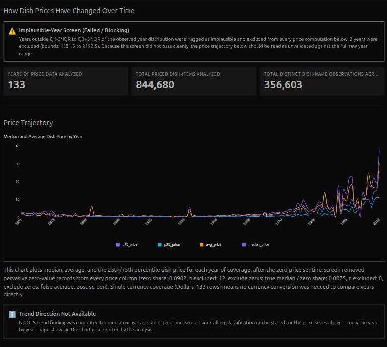
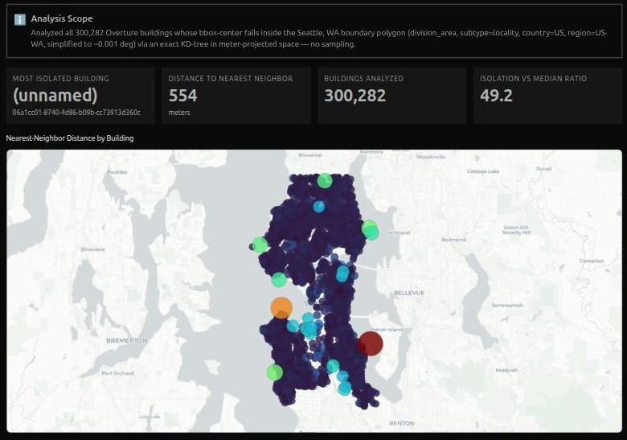
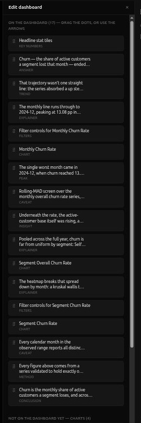
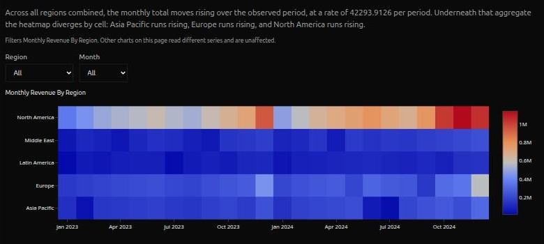
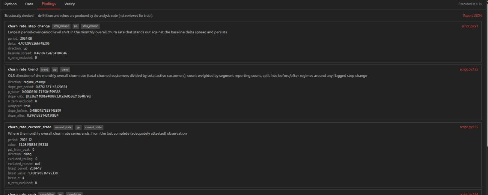
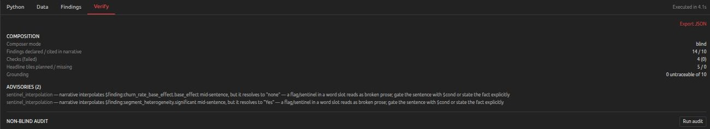

# Hermetic since June: every number in the report traces to a line of code

An AI writes you a confident paragraph about your data. The numbers in it look right. You find out they were wrong in a meeting.

That happens because of one design choice every AI analyst shares. The tool computes the numbers, hands them to a language model, and the model writes the paragraph. The model can round wrong, swap two figures, attach the wrong unit, or invent a cause. Better prompting does not close that gap.

Since June I rebuilt Hermetic so a language model never types a number. The model picks which claims to make. Tested code computes the values, renders the units, and attaches the data checks. A figure with no computation behind it has no way to reach the page.

Hermetic is a free, open-source AI data analyst that runs on your own computer. You ask a question in plain English. It writes the analysis code, and that code runs against your data in a sealed container with no access to the rest of your machine and, by default, no internet. The model sees the shape of your data — column names, types, ranges — and the results of the computation. Your rows stay on your machine.

## What you can do now

### Read a report that refuses to guess

Hermetic turns a dashboard into a document. One small model call writes the prose. Everything else — the structure, the charts, the caveats, the method note — gets built by code from what the analysis computed.

The document carries an answer, a method, and a conclusion at every length setting, including the shortest one. Chart explainers sit above their figure. Caveats sit exactly where they apply. Each caveat names a real data check that the analysis ran, and shows that check's own evidence.

Watch it refuse. On a price series whose years failed a plausibility check, the report marked the price trend unvalidated and said why. On a series where the analysis computed no trend statistic, the report stated no direction at all and pointed at the chart shape instead.

This is the compiled report. It ships this month as a setting you turn on, and it becomes the default once the side-by-side comparisons against the old composer come out even on quality. That comparison is the last thing standing in the way.

### Teach it how your business counts

Your fiscal year might start in February. "Bookings," "billings," and "revenue" might be three different numbers. A generic AI analyst knows none of this, so it hands you a fluent answer built on the wrong denominator, and you find out in a meeting.

A skill is a folder with a plain-text file in it. The file states which definitions apply to a kind of analysis and which mistakes to reject. It can also carry your own tested Python functions, so the analysis calls the method your team already trusts instead of deriving a new one. Drop the folder in and it applies from the next question onward. Five worked examples ship with the product, so nobody starts from an empty page.

The Python part came from graduate students at the University of Chicago. They wanted analyses to run through the methods they already trusted.

Data warehouse vendors address part of this with semantic models, which define your tables and your metrics. A skill carries the method as well: the checks, the refusals, and working code. Hermetic computes a metric the same way in March as in January, because the rule lives in a file rather than in someone's memory.

### Run it from Claude Desktop or Claude Code

Hermetic now works as a tool that Claude can call. Ask Claude a question about your data in its own chat window, and it drives the whole Hermetic pipeline: attach a source, run the analysis, edit the result, audit it.

When an assistant works through your data on its own, rows land in the conversation — a sample printed here, a table dumped there. With a cloud-hosted assistant, that means your records travel to a model provider as a side effect of asking a question. Hermetic's tools hand back the shape of the data and computed results instead, and the code that touches your rows runs in the same sealed container as always. Rows cross only when the assistant asks for them through a tool that says so.

The result also outlives the chat. An assistant's answer is a snapshot in a transcript. Hermetic's answer is a saved analysis that still opens tomorrow, still filters, and still re-runs against fresh data. A billion-row data warehouse question stays a single call, answered inside the warehouse, with no rows pulled into the conversation.

Claude Desktop could not run Hermetic before, because that app cannot run code on your machine. It now works as a Hermetic front end, and it needs no separate developer account.

### Query data that nobody loaded anywhere

Point Hermetic at a data file sitting in cloud storage and ask your question. Nothing downloads. You set up no database.

I tested this on Overture Maps' public buildings catalog — 2.5 billion records, published by Meta, Microsoft, Amazon and TomTom — and asked which building on Earth sits farthest from any other. Hermetic planned the scan from the files' own summary statistics in about 24 seconds. The full answer came back in minutes, on a map.

These files describe their own contents, so Hermetic reads the summary before it reads any data. If the job fits in memory, it runs one exact pass. If the job does not fit, the database counts and summarizes without reading the rows. It throws away whole regions that provably cannot hold the answer, then runs the exact computation on the few candidates that survive.

Event logs, system exports, and open catalogs all sit in cloud storage this way. Asking a question of them used to mean standing up a database and writing a pipeline first. The analyst who wants the answer usually cannot do that.

### Edit the result, and filter it honestly

A dashboard is a live document. Reorder sections. Hide an element. Rewrite the insight paragraph. Narrate a finding the report skipped. Add a chart from the catalog of views the analysis supports but left out. Your edits attach to the names of the claims rather than to positions in a layout, so they survive a re-run against fresh data.

Dashboards also carry working filters. Pick a region or a segment and the chart recomputes from the source table.

The hard case works now. A chart of monthly totals holds one row per month, so the region column has already been summed away by the time the chart exists. Filtering it used to require guessing. The analysis now declares how to rebuild each measure from the source table, and the filter follows that recipe. You can filter a chart by a column its own rows never carried, and the number you get back matches what a fresh query would give you.

Here is an ordinary run. A 506-row spreadsheet of deals, and the question "which regions drive the most revenue, and how has that changed over the year?" Hermetic scoped the analysis to won deals and said so as a data check with the counts attached, computed each region's share, tested whether the regions really differ, fitted a trend per region, and gave the heatmap two working filters.

### Five smaller changes you will feel

**No developer account.** If you already pay for Claude and have its command-line app signed in, Hermetic runs on that login. Setup asks one question: do you already use Claude?

**No time limit.** The old 20-minute cap decided which questions deserved answers. It is gone. You get a duration estimate up front, the current stage and elapsed time on screen, and a stop button that kills the computation. Long runs survive a sleeping laptop and a browser reload.

**Wrong analyses caught before they touch your data.** A second model reads the generated analysis against a set of correctness rules — the built-in ones plus whatever your skills add — and rewrites the code when it finds a violation. The flawed version never reaches your data and never reaches your report.

**Follow-ups keep their filters.** Ask for Q2 revenue excluding cancelled orders, then ask to see it by region. The second query inherits the exclusions and the time window instead of dropping them.

**One file to share.** Export an analysis as a single self-contained web page with the charts and interactivity embedded. Mail it, or open it on a laptop with nothing installed.

## How it works

This section is the engineering detail. Skip it if you want to use the tool rather than build one.

Two months went into a single idea: move judgment out of the model's prose and into tested code.

### The analysis declares what it computed

`declare_finding` records a claim — a name, a typed value, a plain-language definition — right beside the computation that produced it. `declare_check` records a data-quality check the model designed for this dataset, executed as code, with its evidence. `declare_series` declares the chart data with roles: which column is time, which are measures, their units, how many observations back each point, and how to rebuild a measure from the source table.

The narrative then binds those claims rather than restating them. A sentence carries a reference like `$finding:churn_rate_peak`, and the server resolves the value and renders the unit. The Findings tab shows every claim with its definition and the line of code that produced it.

The platform used to infer which columns were the same measure, which counts backed which series, and which values had been screened, all by parsing naming conventions. Most of the reported bugs traced back to that inference.

### Statistics stopped being a judgment call

Every statistical failure on record came from the same thing: a correct statistic applied to data its method does not fit. Is a `$0.00` price a real value or a missing one? Can a year with 52 observations headline a series whose typical year has 600?

That judgment lived in prose the model re-derived on every run, so it was unstable. Two identical runs disagreed about whether `$0.00` was a real price. I stopped arguing about it after that.

You can enumerate every validity condition, because every statistics text lists each test family's assumptions. So I wrote the judgment down as a matrix: twelve claim types by twelve data regimes, all 144 cells filled. A tested Python runtime profiles each declared series and dispatches on the profile. It treats a `$0.00` price as missing when the measure is money, weights a trend by observation count, sends a comparison across groups with extreme values to Kruskal–Wallis, and refuses a provably disordered series instead of fitting it.

A test generates the rendered matrix from the code and pins it, so an empty cell shows up by inspection instead of by a bad run.

### The composer became a compiler

The composer is the part that writes the report. Fabricated mechanisms, missing narrative, wrong bindings, duplicate tiles: every composition defect on record came from a generative process emitting output a type system would have rejected. About 25 automatic patches cleaned up that output afterward.

So the composer inverted. The model's generative act shrank to a short typed plan: a list of sentence types, each naming the claims it may use. ANSWER, TREND, CAVEAT and a few more, plus document structure. Everything downstream is deterministic code whose completeness the TypeScript compiler proves.

The compiler rejects any digit the model typed itself, so numbers enter only as references to a computed finding. A caveat can only reference a declared check and can only render that check's own fields, so the grammar has no way to express a fabricated mechanism. When one sentence fails validation, only that sentence falls back to a template and the rest of the document renders.

Editing runs through the same grammar: move, hide, show, add, remove, set insight. The web UI and the assistant-facing tools both use it. Every edit re-validates and recompiles, so the invariants hold for a human editor as much as for the model.

The Verify panel reports which composer ran, how many findings were declared and cited, how many checks passed, and how many narrative figures traced to a computed result. An on-demand adversarial audit reads the whole thing back and files what it finds into the record.

### Where your data goes

Files, execution, warehouse connections, dashboards, and the viewer all stay on your machine. When you drive Hermetic from an assistant, everything a tool returns crosses into that assistant. If the assistant is cloud-hosted, results reach its provider — a property of the host you chose. Hermetic caps that crossing, logs it with sensitive arguments stripped, and describes it honestly. Credentials never cross. Drive it from a local model and nothing leaves the machine at all.

I did not write the assistant's logic. A model decides at runtime what to call, and its context may carry instructions from documents it has read. So the controls follow authorship. SQL the assistant writes passes a read-only gate before any database sees it. Python the assistant writes runs with networking off, always; Hermetic's own generated code keeps whatever network access the analysis justified. Every dashboard the assistant writes is validated and rejected on failure, rather than warned about.

Hermetic's own code legitimately needs the network when it analyzes a cloud dataset, and "needs the network" used to mean the open internet. The analysis container now sits on a private network with no route out. Its only door is a Hermetic-owned proxy that forwards to the storage host being analyzed and nowhere else. Continuous integration points that container at an address that must never receive traffic; if it ever does, the build fails. A second address proves the test was live. I broke the allowlist two ways on purpose, and the build caught both.

### One codebase, three ways to run it

Hermetic used to be a web app with libraries inside it. One set of libraries now runs under three interchangeable harnesses: the web app, the command line, and the assistant-facing server. A record-and-replay layer over every model call lets full user journeys run in continuous integration against recorded transcripts, so a change that breaks a journey fails the build instead of a demo.

## What I got wrong

**I fixed the memory three times before finding the cause.** Long runs kept dying. I hardened memory handling, twice. The real culprit was my own cleanup process, which had lost track of active work and was terminating it on a schedule. The lesson runs through the project now: confirm that a failure is what it looks like before you engineer around it.

**The model complied and Hermetic dropped the result.** A run came back missing its declared findings. I assumed the model had ignored the contract. The transcript showed the model had declared everything correctly, and Hermetic had lost the declarations on the way through, in two separate places.

**I mistook a return shape for a security control.** The first version of the assistant-facing server trimmed chart data to samples and hid identifier values, in the name of the data boundary. A blunt question during testing killed it: we don't hide rows from the browser, so why hide them from an assistant? The assistant writes the queries and receives the results, and it can request rows through two sanctioned tools whenever it wants. Hiding them elsewhere protected nothing. The boundary described above is the narrower, accurate claim, and I amended the project's own spec rather than quietly rewriting it.

**Compiled prose is flat.** I ran the compiled report against recorded analyses before shipping, and the sentences came out correct and mechanical. They still do. I took the trade, because better templates fix flat prose and nothing fixes a wrong number after someone has acted on it. Making the writing good enough to be the default is the next piece of work.

**A model review of my own merge found fourteen problems.** Two were correctness bugs. One was a credential leak: the log would have recorded a temporary signed download link in full. It never reached a release, and that log now has its own tests.

## What comes next

**Budgets.** An investigation that knows how much time and money it has left, and weighs whether the next step is worth it. Removing the fixed 20-minute cap cleared the way, and this is next in line.

**Compiled by default.** The compiled report becomes the default once the side-by-side comparisons hold, which means growing the template library until the prose reads well.

**Learning from one correction.** Hermetic keeps a ledger of its own failures and proposes rules from them, plus a bank of examples from past clean runs. A run that a check flagged never teaches. The target has not changed: correcting a flawed analysis once should be enough.

**Assistant-authored dashboards.** Exposing the component catalog so an assistant can build a dashboard directly, plus tools for scheduled refreshes and multi-step investigations.

## Try it on one question

Hermetic runs on macOS and Linux, and needs Docker. Clone the repository and run `./start.sh`. The script checks what you have, installs the rest, asks which sandbox and which model to use, and starts the app. Most of the first run is downloading.

The software is free and the code is public. The model is the part that costs. Point it at your Claude subscription and you pay nothing extra; point it at a provider API key and you pay that provider per run, with a cost meter in the app showing you what each question cost; point it at a model running on your own machine and you pay nothing at all.

Then point it at a spreadsheet you already argue about and ask the question you would normally hand to an analyst.

Two asks. Turn on the compiled report and tell me where the prose reads badly, because that gap is all that stands between here and making it the default. And if you write a skill that teaches Hermetic something about your business, send it to me.

I build this on my own, in the open. Bugs and questions go in the repository's issues, and I answer them.

Open source, local first: github.com/achalp/hermetic
